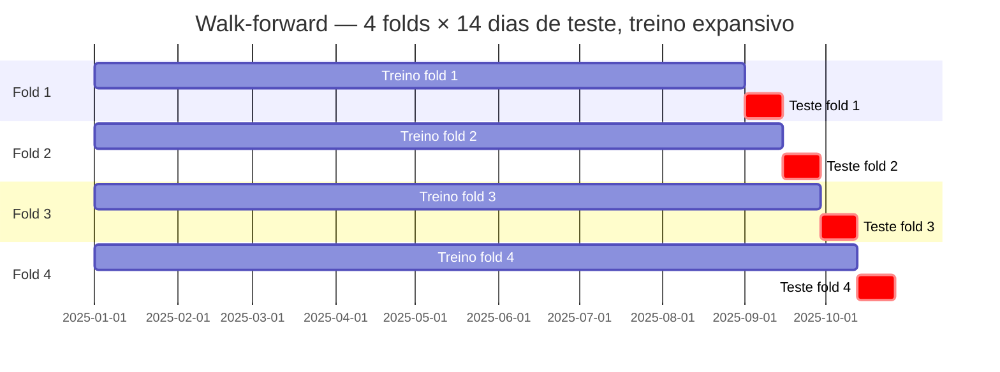
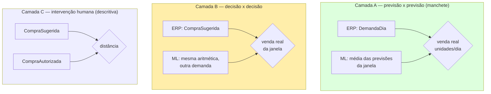

# 04 — Avaliação e Métricas

> Fases **F6.1**, **F7** e **F13** do roadmap · projetos [CosmosPro.ML.DemandForCast.Forecasting](../CosmosPro.ML.DemandForCast.Forecasting/) (subdirs `Evaluation/` e `Comparison/`) e [CosmosPro.ML.DemandForCast.Purchasing](../CosmosPro.ML.DemandForCast.Purchasing/) (subdir `Comparison/`)

## O quê

Como **medir honestamente** se um engine é melhor que outro. Cobre:

1. **Métricas pontuais**: MAE, RMSE, WAPE, MAPE — o que são, quando quebram.
2. **Walk-forward backtest**: o protocolo de avaliação que simula uso real no futuro.
3. **Drill-down por hierarquia**: descobrir onde o modelo é bom e onde regride.
4. **Comparativo contra o ERP real (F13)**: as três camadas, as duas regras que tornam a comparação legítima, e o que o trabalho **não** pode concluir hoje.

## Por quê

> "Em séries temporais, dividir treino/teste aleatoriamente é o equivalente metodológico a dar prova com gabarito junto."

Em ML tabular comum, fazemos `train_test_split(X, y, random_state=42)`. Em previsão de demanda **isso é proibido**: o modelo poderia ver o futuro no treino e o passado no teste, "decorar" o ruído, e na produção falhar feio.

Pior ainda: uma única **métrica global** esconde **regressões locais** — o modelo pode ser ótimo na média e péssimo num cluster de SKUs que importa muito. A próxima tela mostra exatamente isso na nossa POC:


Categoria a categoria, LightGBM bate o naïve — mas há células onde o ganho é pequeno ou nulo, e a UI **destaca em vermelho** quando há regressão.

---

## Métricas {#metricas}

Quatro métricas pontuais convivem na nossa avaliação. Cada uma responde a uma pergunta diferente.

### MAE — Mean Absolute Error

$$
\text{MAE} = \frac{1}{N} \sum_{i=1}^{N} \left| y_i - \hat{y}_i \right|
$$

**Pergunta que responde:** "Em média, em quantas unidades erro?"

- **Unidade:** mesma da venda (unidades).
- **Interpretável:** "MAE = 3,2" → erro em torno de 3 unidades por dia × SKU × loja.
- **Limitação:** depende da escala. Não dá pra comparar entre SKUs de volumes diferentes.

### RMSE — Root Mean Squared Error

$$
\text{RMSE} = \sqrt{\frac{1}{N} \sum_{i=1}^{N} (y_i - \hat{y}_i)^2}
$$

**Pergunta que responde:** "Quão punidor são os outliers?"

- **Unidade:** mesma da venda.
- Eleva ao quadrado → **erros grandes pesam muito mais que erros pequenos**.
- Útil quando o custo da subestimativa cresce não-linearmente (ruptura grave > pequena).
- RMSE > MAE sempre. Razão `RMSE / MAE` indica a "cauda" do erro: próximo de 1 = erro uniforme; >> 1 = outliers grandes.

### WAPE — Weighted Absolute Percentage Error {#wape}

$$
\text{WAPE} = \frac{\sum_{i=1}^{N} \left| y_i - \hat{y}_i \right|}{\sum_{i=1}^{N} y_i}
$$

**Pergunta que responde:** "Que percentual do volume total erro?"

- **Adimensional**, comparável entre SKUs/categorias/redes.
- **Robusto a zeros**: o denominador é o **total** de vendas, não uma média de razões.
- **Pondera por volume**: erros em SKUs A pesam mais que em SKUs C (porque o numerador agrega valores absolutos e o denominador soma o volume — o item A "puxa" o denominador).
- É a métrica **primária** que reportamos no TCC. É também o padrão *de facto* em previsão de demanda no varejo.

**Exemplo:** vendi 1000 unidades no período e a soma dos erros absolutos foi 250 → WAPE = 25%.

### MAPE — Mean Absolute Percentage Error

$$
\text{MAPE} = \frac{1}{N} \sum_{i=1}^{N} \left| \frac{y_i - \hat{y}_i}{y_i} \right|
$$

**Pergunta que responde:** "Em média, em qual % erro por observação?"

- **Limitação grave:** **explode com $y_i = 0$** (divisão por zero) e fica gigante para $y_i$ pequeno. Em farma é comum (cauda longa vende 0 na maioria dos dias).
- Damos um *guard*: ignoramos observações com $y_i = 0$ no cálculo. Mesmo assim, fica enviesado contra séries de baixo volume.
- Reportamos porque o **TCC tradicionalmente cita MAPE** — então ele aparece, mas com asterisco. **WAPE é o que comparamos.**

### Tabela-resumo: qual usar?

| Métrica | Unidade | Sensível a outliers | Quebra em zero | Comparável entre escalas |
|---|---|---|---|---|
| MAE | unidades | médio | ✓ | ✗ |
| RMSE | unidades | **alto** | ✓ | ✗ |
| **WAPE** | % | médio | **✓** | **✓** |
| MAPE | % | médio | **✗** | parcial |

---

## Walk-forward backtest {#walk-forward}

### Conceito

Em vez de uma única divisão "treino até data X, teste depois", roda **várias divisões deslizantes** simulando o que aconteceria se o modelo tivesse sido usado em produção em vários momentos.



A cada fold:
1. **Treina** com tudo até o início da janela de teste daquele fold.
2. **Prevê** os próximos 14 dias.
3. **Calcula métricas** comparando previsão × venda real.

No final, **médias** das métricas entre folds. Esta é a métrica "honesta".

### Por que "expansivo" (treino sempre começa do início)?

Alternativa seria janela **deslizante** de tamanho fixo (sempre últimos N meses). Expansivo é mais adequado quando temos pouco histórico (o caso do POC) — joga fora menos sinal. Sliding faria sentido se houvesse **mudança estrutural** (rebranding, expansão da rede) que invalida o passado.

### Implementação

[WalkForwardBacktest.cs](../CosmosPro.ML.DemandForCast.Forecasting/Evaluation/WalkForwardBacktest.cs):

```csharp
foreach (var fold in folds) {
    var trainSet = observations.Where(o => o.Date < fold.TestStart);
    var testSet  = observations.Where(o => o.Date >= fold.TestStart 
                                        && o.Date < fold.TestEnd);

    var trainFeatures = featureBuilder.Build(trainSet);
    var model = engine.Fit(trainFeatures);

    var testFeatures = featureBuilder.Build(testSet);
    var predictions  = testFeatures.Select(f => model.Predict(f));

    var metrics = ComputeMetrics(testSet, predictions);
    foldMetrics.Add(metrics);
}
```

### Por que 4 folds × 14 dias?

- **14 dias** = duas semanas — uma janela de teste que cobre 2 ciclos semanais completos. Suficiente para a sazonalidade semanal não "contaminar" o resultado (se fossem 5 dias, o fim-de-semana ficaria sub-representado).
- **4 folds** = ~2 meses de cobertura de teste. Mais que 4 começa a comer histórico de treino curto. Em produção, 6-8 folds seria o normal com mais dados.

Parametrizado em `BacktestOptions`; configurável caso o dataset ofereça mais histórico.

---

## Resultado: o quadro comparativo

Cada engine produz um `EngineResult` com `Metricas` globais + `PorDimensao` (drill-down). A UI consolida lado a lado:

| Engine | MAE | RMSE | WAPE | MAPE | N | Sobre baseline |
|---|---|---|---|---|---|---|
| Naïve Sazonal | 8,72 | 13,9 | **60,7%** | 142% | 1190 | — |
| Média Móvel | 6,75 | 10,1 | 47,3% | 88% | 1190 | −13,4pp |
| **LightGBM** | **4,18** | **6,9** | **29,4%** | **52%** | 1190 | **−31,3pp** |

> Ler: LightGBM corta **mais da metade** do WAPE do naïve. Isso é "vencer o baseline com folga" — justifica a complexidade do gradient boosting no POC.


---

## Drill-down por hierarquia {#drill-down}

### Por quê

Imagine que o LightGBM tem WAPE médio 29,4% — ótimo. Mas:
- Na **categoria Crônicos** ele tem WAPE 22% (excelente);
- Na **categoria OTC** tem WAPE 18% (excelente);
- Na **categoria Pediátrico** tem WAPE 41% (**pior que naïve**, que faz 35%).

A média global esconde a falha. Crônicos e OTC têm volume alto, "puxam" a média. Pediátrico tem volume baixo mas é onde uma regressão dói para o negócio.

A solução: **pivotar as métricas por dimensão** — categoria, classe ABC, loja, UF — e mostrar **lado a lado**, por engine, em cada célula.

### Tela


Cada linha: uma loja (ou categoria, etc.). Colunas: WAPE de cada engine. **Última coluna: vencedor**.

**Linhas vermelhas:** LightGBM pior que **o melhor** baseline (naïve ou MA) naquela dimensão. Sinal vermelho para revisar features ou hiperparâmetros para aquele segmento.

### Implementação

[Treinamento.razor](../CosmosPro.ML.DemandForCast.Web/Components/Pages/Treinamento.razor) — método `BuildDrillRows(engines, dimension)`:

```csharp
private DrillRow[] BuildDrillRows(EngineResult[] engines, string dimension) {
    var allKeys = engines
        .SelectMany(e => e.PorDimensao[dimension].Keys)
        .Distinct();
    return allKeys.Select(key => {
        var wapesByEngine = engines.ToDictionary(
            e => e.Nome,
            e => e.PorDimensao[dimension][key].Wape);
        var vencedor = wapesByEngine.MinBy(kv => kv.Value).Key;
        var lgWape = wapesByEngine["LightGBM"];
        var melhorBaseline = wapesByEngine
            .Where(kv => kv.Key != "LightGBM")
            .Min(kv => kv.Value);
        var regrediu = lgWape > melhorBaseline;
        return new DrillRow(key, ..., wapesByEngine, vencedor, regrediu);
    }).ToArray();
}
```

### Dimensões disponíveis

| Dimensão | Para que serve |
|---|---|
| **Categoria** | Detecta onde o modelo aprende bem (sazonalidade, promo previsível) vs onde falha (categorias intermitentes) |
| **ClasseAbc** | Cauda longa (classe C) vs giro alto (A). Modelo costuma ser pior em C — confirma se a regressão é "natural" |
| **Loja** | Detecta loja outlier (operação peculiar, mudança recente) |
| **UF** | Mais relevante em redes multi-estado; em POC é controle |

---

## HelpTips: explicando jargão na UI

Toda a UI usa HelpTips (popovers que aparecem no hover) para explicar termos:


Constantes definidas no topo de [Treinamento.razor](../CosmosPro.ML.DemandForCast.Web/Components/Pages/Treinamento.razor):

```csharp
const string TipWape = "WAPE = soma dos erros absolutos / soma do volume total. ...";
const string TipMape = "MAPE = média dos erros percentuais. Cuidado: explode com vendas baixas. ...";
const string TipRegressao = "Marcado em vermelho quando LightGBM tem WAPE pior que o melhor baseline (naïve ou MA) naquela dimensão.";
```

A intenção é o **gestor de farma** (não-técnico) conseguir ler o relatório sozinho.

---

## Comparativo contra o ERP real {#comparativo-erp}

> Fase **F13**. Tudo acima compara engines nossos entre si (LightGBM contra naïve e média móvel). Esta seção compara o nosso engine contra o **método que a farmácia usa hoje de verdade**.

### Por que o baseline mudou

Até a F8, o "método clássico" do TCC era uma **reimplementação nossa** da regra eMax/eSeg (`EMaxESegPolicy`). Ela foi **aposentada**. O motivo é metodológico e não de engenharia: uma reimplementação mede a nossa leitura da regra, não a regra. Se o ML vencesse, a banca perguntaria — com razão — se o ML venceu o método tradicional ou apenas a nossa versão dele.

A partir da F12 o Stage recebe as tabelas [`dbo.SugestoesCompra`](../CosmosPro.ML.DemandForCast.Database/Tables/SugestoesCompra.sql) e [`dbo.SugestoesCompraItens`](../CosmosPro.ML.DemandForCast.Database/Tables/SugestoesCompraItens.sql), extraídas do ERP **PBS** (mapeamento em [Docs/extracao-pbs-stage.md](extracao-pbs-stage.md)). Elas trazem, gravado pelo próprio ERP:

| Campo | O que é |
|---|---|
| `DemandaDia` | A **previsão de demanda do próprio ERP**, em unidades/dia. É o campo que viabiliza comparar previsão contra previsão. |
| `EstoqueSeguranca`, `EstoqueMaximo` | O eSeg e o eMax que o ERP calculou. Vêm zerados em `TipoCalculo = 2`, que não os usa. |
| `CompraSugerida` | O que o ERP mandou comprar. |
| `CompraAutorizada` | O que o comprador aprovou. |
| `Curva` | A classe de giro (A..E) que o próprio ERP atribuiu — é o eixo em que ele se parametriza. |

E o cabeçalho traz `TipoCalculo`: **1 = `Emax e Eseg`** e **2 = `Dias de Reposição`**. São **dois métodos tradicionais distintos**, ambos em uso no PBS. Uma execução do comparativo mira sempre em **um** deles e em **uma** rede — média entre baselines diferentes não significa nada, e duas redes são dois estudos de caso, não uma amostra. Os comparadores **recusam** população que misture os dois (`ValidarHomogeneidade`).

### As três camadas



**As três medem coisas diferentes e não se somam.** A camada A pontua uma taxa (unidades/dia), a B pontua uma quantidade (unidades na janela), a C não pontua acurácia de ninguém.

---

### As duas regras

Sem elas o número não significa nada. Ambas são **verificadas**, não presumidas: violação estoura `ArgumentException` com a razão no texto, em vez de virar resultado silencioso.

#### Regra de população

> **Só entram os pares (`SugestaoId`, `LojaId`, `Sku`) que o ERP de fato avaliou.**

A sugestão do ERP cobre uma fatia filtrada do catálogo — ele não olha todo item de toda loja em toda execução. Pontuar o ML sobre um conjunto mais largo compararia dois recortes diferentes: o ML apareceria bom (ou ruim) em itens sobre os quais o ERP nunca se pronunciou, e a diferença não seria atribuível a nenhum dos dois métodos.

Na prática:

- A população sai de `SugestoesCompraItens` ([`StageSugestaoLoader`](../CosmosPro.ML.DemandForCast.Worker/Comparison/StageSugestaoLoader.cs)) e o [`ComparacaoProcessor`](../CosmosPro.ML.DemandForCast.Worker/Comparison/ComparacaoProcessor.cs) **só a encolhe**, nunca a alarga.
- Os comparadores recusam dia-alvo de outra loja/SKU, par duplicado, dia repetido dentro de um par, e — na camada B — dia fora da janela coberta pela compra.
- Recusam também hierarquia variável dentro do par (`Categoria`, `ClasseAbc`, `UF`): a quebra por dimensão depende desse atributo ser constante, senão o par cairia no balde que o chamador ordenou primeiro.
- **Cada motivo de exclusão tem contador próprio** — `ItensForaCamadaA`, `ItensForaCamadaAAlemDoHistorico`, `ItensForaCamadaB`, `ItensForaCamadaBAlemDoHistorico`, `ItensForaOrcamentoSkus` em `ComparacaoOutput`. "Não tínhamos série", "a cobertura passou do fim do histórico importado" e "o SKU não coube no orçamento top-`MaxSkus`" são causas distintas, e um balde único as tornaria indiagnosticáveis.

#### Regra de informação

> **O ML só pode usar dado com data estritamente anterior a `SugestoesCompra.DataHora`.**

Estritamente anterior inclusive ao próprio dia da sugestão: as vendas daquele dia só se fecham depois do instante em que o ERP calculou. É aplicada em **três pontos**, e cada um fechou um caminho concreto pelo qual o resultado teria saído inflado.

| Ponto | O que faz | O buraco que fechou |
|---|---|---|
| **Corte de treino** — [`TreinoJob.TreinoAte`](../CosmosPro.ML.DemandForCast.Engine/Entities/TreinoJob.cs) + filtro em toda consulta datada do [`StageObservationLoader`](../CosmosPro.ML.DemandForCast.Worker/Training/StageObservationLoader.cs) | Nenhuma observação com data ≥ corte entra no ajuste do modelo. O `ComparacaoProcessor` **recusa** o job quando o treino de origem rodou sem `TreinoAte`, ou quando a `TrainingResult.UltimaDataTreinada` não é anterior à sugestão mais antiga da janela. | O extrator traz de propósito os dias **posteriores** à sugestão — são o gabarito. Sem corte, o modelo treinava sobre o gabarito e a comparação media memória, não previsão. Encontrado durante a implementação da F13, não em revisão posterior. |
| **Congelamento de preço** — [`FeatureConfig.PrecoCongeladoAPartirDe`](../CosmosPro.ML.DemandForCast.Features/FeatureConfig.cs) | Para todo dia-alvo D ≥ corte, `PrecoUnitario` e `PrecoRelativoMedia` passam a usar o último preço conhecido **estritamente antes** do corte. | O preço que chega ao `FeatureBuilder` é o preço **realizado** da venda daquele dia. Numa remarcação não planejada, o desconto do próprio dia pontuado entrava na feature daquele dia e o modelo lia "desconto → volume" no dia que estava sendo julgado. |
| **Validação por item** — `ValidarItem`/`ValidarJanela` nos dois comparadores | Para cada dia-alvo D, exige `D − LeadTimeDias < DataHora`. Exige também que `ModeloTreinadoAte` e `PrecoCongeladoAPartirDe` declarados batam com o corte. | O comparador recebe um escalar de previsão pronto e não enxerga as features. Sem os dois campos `required`, uma população montada com `FeatureConfig` default (sem congelamento) ou com um modelo sem corte passaria calada por todas as demais checagens. |

**Limite honesto dessa terceira linha:** `ModeloTreinadoAte` e `PrecoCongeladoAPartirDe` são **declarações** de quem monta a população, não provas. O comparador valida a igualdade; ele não consegue inspecionar se o `FeatureBuilder` de fato aplicou o congelamento. O que fecha o buraco na prática é o `ComparacaoProcessor` usar a **mesma variável local** (`corte`) para alimentar o `FeatureBuilder` e para preencher a declaração — separá-las em duas variáveis reabriria a brecha.

---

### Camada A — previsão contra previsão {#camada-a}

**É a manchete do TCC.** [`ForecastVsErpComparer`](../CosmosPro.ML.DemandForCast.Forecasting/Comparison/ForecastVsErpComparer.cs).

Compara `DemandaDia` (ERP) contra a previsão do ML, ambas julgadas pela **mesma venda real**. Mesma grandeza, mesma data, mesma unidade (unidades/dia). É a comparação mais limpa possível porque não depende de arredondamento de embalagem nem de posição de estoque — ao contrário da quantidade de compra.

Por par (`SugestaoId`, `LojaId`, `Sku`):

| Grandeza | Como é obtida |
|---|---|
| Verdade | Média de `FeatureVector.Target` (unidades vendidas) sobre os dias pontuáveis da janela |
| Braço ERP | `max(0, DemandaDiaErp)` — um escalar, já em unidades/dia |
| Braço ML | `max(0, média das PrevisaoMl)` sobre os mesmos dias |
| Julgamento | Menor erro absoluto vence; diferença ≤ `EmpateTolerancia` (default `1e-9`) é empate |

A janela da camada A é `min(DiasEstoque, LeadTimeDias)` dias a partir do corte — como ela pontua uma **taxa**, basta a parte da cobertura que o lead time das features alcança. Com o lead time de 7 dias, o dia mais distante pontuável é `corte + 6`; além dele o dia-alvo seria alimentado por observação posterior ao corte, e a regra de informação o recusaria, com razão.

Saída (`ComparisonResult`): `ParesAvaliados`, `ParesDescartados`, `Unidade`, um `ArmResult` por braço (`ForecastMetrics` globais + `PorDimensao`), `Vitoria` (`WinRate`), `VitoriaPorDimensao` e o `Detalhe` par a par. As dimensões são as mesmas do walk-forward (`Categoria`, `ClasseAbc`, `Loja`, `UF`) mais **`CurvaErp`** — a curva de giro que o próprio ERP atribuiu, o eixo em que o método antigo se parametriza e portanto aquele em que se espera que ele seja mais competitivo.

> **`UnidadeMetrica.ErroPorParNaJanela`.** As métricas da camada A têm **um ponto de erro por par**, com previsão e verdade promediadas sobre a janela. O `WalkForwardBacktest` tem um ponto por (dia, loja, SKU) — `UnidadeMetrica.ErroPorDia`. Promediar encolhe a variância: para o **mesmo modelo**, o MAE daqui sai sistematicamente **menor** que o MAE do backtest, sem que nada tenha melhorado. Os dois painéis não podem ser lidos lado a lado sem esse rótulo, e por isso ele viaja no resultado.

---

### Camada B — decisão contra decisão {#camada-b}

[`DecisionComparer`](../CosmosPro.ML.DemandForCast.Purchasing/Comparison/DecisionComparer.cs). Dada a previsão de cada lado, **quantas unidades cada um compraria**, e qual escolha teria servido melhor a venda que de fato ocorreu.

**Troca só a demanda.** A quantidade do braço ML sai da aritmética do próprio ERP — mesmo `EstoqueSaldo`, mesmos `PedidosPendentes`, mesmo `DiasEstoque`, mesmo `FatorEmbalagem` — com `DemandaDia` substituído pelo do ML. Se duas coisas mudassem, nenhuma diferença poderia ser atribuída à previsão.

Aritmética modelada:

- **`TipoCalculo` 2 — `Dias de Reposição`:** `necessidade = demanda/dia × DiasEstoque`.
- **`TipoCalculo` 1 — `Emax e Eseg`:** repõe até o `EstoqueMaximo` gravado, reescalado pela razão `r = demanda_ml ÷ DemandaDia`.
- Nos dois: `compra = arredonda_para_cima(max(0, necessidade − posição de compra), FatorEmbalagem)`.

**Posição de compra ≠ posição pontuada.** A primeira obedece `ConsideraPedidosPendentes` (é assim que o ERP decide); a segunda — `EstoqueSaldo + PedidosPendentes + compra`, medida contra a venda real — conta os pendentes **sempre**, porque mercadoria em trânsito chega e atende a janela independentemente de o ERP tê-la considerado. O vencedor de cada item é o de menor `|posição resultante − venda real|`, o que evita arbitrar quanto custa uma unidade parada contra uma unidade faltando — peso que este projeto não tem como calibrar.

#### O portão de reconciliação

Não temos o código-fonte do ERP: a aritmética acima é um **modelo** dele. Antes de comparar qualquer coisa, o comparador **recalcula o `CompraSugerida` gravado a partir do `DemandaDia` gravado**. Se reproduz (divergência ≤ `ToleranciaReconciliacao`, default `0,001` = uma unidade da última casa de `DECIMAL(15,3)`), trocar a demanda é legítimo. Se não reproduz, o item sai da comparação e fica listado em `DetalheReconciliacao` com os dois valores e a **diferença assinada** — o sinal é o que torna a falha diagnosticável.

`StatusReconciliacao` tem três valores: `Reconciliado` (só estes entram na comparação agregada), `Divergente`, e `BracoMlIndeterminado` — `TipoCalculo` 1 com `DemandaDia` zero, em que a razão `r` não existe e o braço ML não pode ser construído (o braço ERP ainda seria, porque o eMax está gravado; sem par comparável, o item sai).

O `ReconciliacaoResumo` traz `TaxaConcordancia` (nullable), `DivergenciaAbsMedia` e `DivergenciaAbsMaxima` calculadas **só sobre os divergentes** (incluir quem bateu empurraria a média a zero justamente quando a concordância é alta), e o recorte `PorCurva`.

`TaxaConcordancia` é **nullable de propósito**: com população vazia, ou com a população reconciliando por inteiro e mesmo assim nenhum item chegando a ser comparado (o caso real de horizonte 7 contra cobertura de 30 dias), a taxa sairia `1,0` e leria como "comparação bem-sucedida" o que não comparou nada.

#### `UtilidadeComparacao` — o campo a ler primeiro

`ItensComparados == 0` **não impede** um resultado bem formado: os dois braços saem zerados e o `WinRate` sai `(0,0,0,0)`. Por isso o resultado carrega `UtilidadeComparacao`: `Utilizavel`, `PopulacaoVazia`, `ForaDoHorizonteMl`, `DescartadoPorRuptura`, `ReconciliacaoDivergente` ou `SemItensComparaveis`. **Zero comparações não é empate.**

---

### Camada C — sugestão do ERP contra aprovação do comprador {#camada-c}

[`HumanOverrideReport`](../CosmosPro.ML.DemandForCast.Purchasing/Comparison/HumanOverrideReport.cs). Compara só dois números que o próprio ERP gravou: `CompraSugerida` e `CompraAutorizada`. Sem braço de ML, sem venda real, e portanto sem pergunta de ruptura ou de corte de informação.

Classificação exaustiva e mutuamente exclusiva de cada linha: **sem override**, **veto** (`CompraAutorizada = 0` com `CompraSugerida > 0`), **adição** (`CompraSugerida = 0` com `CompraAutorizada > 0`), **ajuste para cima** e **ajuste para baixo** (ambos positivos). Veto e adição são checados antes dos demais: recusar a compra inteira ou comprar do nada é qualitativamente diferente de ajustar uma quantidade.

Sai em duas bases (`HumanOverrideFigures`): **não ponderada** (peso 1 por linha) e **ponderada por valor** (peso `PrecoCompra × valor-de-referência`, onde o valor-de-referência é `CompraSugerida`, ou `CompraAutorizada` numa linha de adição). Mais `DesvioRelativoMedioAbsoluto` e `DesvioRelativoMedioAssinado` — reportados **sempre juntos**, porque overrides que se cancelam (uma linha +50%, outra −50%) deixariam o assinado perto de zero com o absoluto alto, e só os dois juntos distinguem "sem intervenção" de "intervenção que se cancela no agregado".

> **Isto é estatística descritiva, não avaliação de acurácia.** Um override mede que o comprador discordou do ERP, **não quem estava certo**. A discordância pode ser erro do comprador, ou informação que nem o ERP nem nenhum modelo enxergariam — um acordo pontual de fornecedor, um concorrente fechando, um surto local. O que a camada C responde é empírico e limitado: **o "método atual" desta rede é o ERP, ou o ERP mais uma pessoa?**

---

### Ruptura: o que é descartado, e por quê o descarte é por par

Venda observada em dia de ruptura subestima a demanda — o item não vendeu porque não estava lá ([CLAUDE.md §6](../CLAUDE.md)). `RupturaTratamento` tem três modos:

| Modo | Uso | Por quê |
|---|---|---|
| **`ExcluirPar`** | **Padrão e manchete.** Qualquer ruptura na janela invalida o par inteiro. | É o **único** modo em que os dois braços são pontuados sobre exatamente o mesmo conjunto de dias. Custa população — ruptura é frequente em farma —, e por isso `ParesDescartados` é reportado ao lado de `ParesAvaliados`. |
| `ExcluirDia` | Só sensibilidade, na camada A. **Recusado** na camada B. | Parece simétrico e não é: o ML tem uma previsão por dia e **se reprojeta** sobre os dias sobreviventes; o ERP entrega um escalar único para a janela e não tem como se reprojetar. Como ruptura correlaciona com demanda alta, a seleção é feita sobre um desfecho e **só um dos braços se adapta a ela** — um ML que errasse feio exatamente nos dias descartados sairia impune. Na camada B é pior ainda: pontuar uma compra dimensionada para N dias contra a venda de menos que N. |
| `Incluir` | Só sensibilidade. | Pontua a venda observada como se fosse demanda. Piso pessimista, sabidamente enviesado para baixo. Nunca é resultado. |

O ponto que decidiu o default: **descartar por dia favoreceria o braço de ML**, e verdade compartilhada não é viés compartilhado quando os braços têm graus de liberdade diferentes em relação à seleção.

---

### Métricas, taxa de vitória e como ler as duas juntas

O comparativo **reusa o mesmo [`ForecastMetrics`](../CosmosPro.ML.DemandForCast.Forecasting/Evaluation/ForecastMetrics.cs)** do walk-forward — MAE, RMSE, WAPE, MAPE, com o mesmo *guard* de MAPE em real zero. Nada de métrica nova para o comparativo: `ArmResult` tem a mesma forma de `BacktestResult` (`Global` + `PorDimensao`) justamente para a UI renderizar os dois painéis com o mesmo código. O que muda é a **unidade**, e ela é rotulada.

A **taxa de vitória** (`WinRate`) é o placar par a par: `TaxaVitoriaMl = VitoriasMl / N`. A regra de empate é explícita — **empate nunca conta como vitória de ninguém, mas conta no denominador**. Sem isso, uma população com muitos empates inflaria as duas taxas ao mesmo tempo.

> **A taxa de vitória nunca deve ser lida sozinha.** Ela conta **pares**, e todo par pesa 1 — o SKU de giro alto e o de cauda longa contam igual. O WAPE conta **volume**: erros em itens de alto giro pesam mais. As duas leituras divergem por construção, e a divergência é informativa:
>
> - **Taxa alta + WAPE pior:** o ML ganha na maioria dos itens, mas erra feio nos poucos que respondem pelo volume. Comercialmente, é derrota.
> - **Taxa baixa + WAPE melhor:** o ML acerta onde há volume e perde na cauda de baixo giro. É o resultado matizado que a banca espera — e casa com o que o drill-down por `ClasseAbc` costuma mostrar.
>
> Por isso os dois vêm no mesmo resultado, globais **e** por dimensão (`VitoriaPorDimensao`), e a tela `/comparacao` os exibe lado a lado com sinalização de regressão por dimensão.

---

### Limitações declaradas

Todas apareceram durante a implementação da F13 e estão **fechadas** ou **delimitadas** no código — nenhuma é hipotética. Estão aqui porque são exatamente o que uma banca pergunta, e um documento que as omitisse seria pior que nenhum.

#### 1. A camada B não compara nada hoje

A cobertura de uma sugestão do PBS (`DiasEstoque`) roda tipicamente **15 a 30 dias**. O pipeline de previsão de F5/F6 tem **horizonte de 7 dias** — as features de histórico são construídas com lead time 7, então o dia mais distante cujas observações são todas anteriores ao corte é `corte + 6`. Um item com `DiasEstoque > 7` sai da comparação listado em `ForaDoHorizonteMl`, com o motivo por item, e o resultado inteiro carrega `Utilidade = ForaDoHorizonteMl`.

Isso é **lacuna de capacidade de previsão multi-horizonte**, não vazamento nem erro de fórmula. O construtor do `DecisionComparer` recusa `HorizonteMaximoMl > LeadTimeDias` — é o ponto único que uma tarefa futura precisa satisfazer para destravar a camada.

> **O que o trabalho pode afirmar hoje:** que o ML prevê melhor (ou pior) que o ERP **na taxa de demanda diária, sobre a fração da cobertura que o horizonte de 7 dias alcança** — camada A. Não pode afirmar nada sobre o **desfecho de uma decisão de compra de ciclo completo**. Escrever a conclusão como se cobrisse o ciclo inteiro seria falso.

#### 2. O portão de reconciliação nunca foi validado contra dado real

**Nenhuma sugestão real do PBS foi reconciliada até agora.** Os testes da camada B rodam sobre populações construídas. Consequência para a leitura do resultado:

> Uma **taxa de concordância baixa em dado real significa "não modelamos o ERP"**, não "o ML ganhou". Abaixo de um patamar alto, nenhum número da camada B é apresentável — e a tela `/comparacao` retém os números nesse caso, dizendo que existem e por que estão retidos.

Itens que reconciliam são itens em que nenhuma regra extra do ERP entrou (`Efetividade`, piso de `EstoqueMinimo`, lote mínimo), e essas regras não se distribuem uniformemente pelo catálogo — daí o recorte `PorCurva`: uma taxa global alta com uma curva inteira divergindo é sobrevivência seletiva.

#### 3. O braço ML do `TipoCalculo` 1 repousa sobre uma suposição

Em `Emax e Eseg` o ERP repõe até o `EstoqueMaximo`. Como o eMax dele é função da demanda dele, mantê-lo fixo faria a demanda sumir da conta e os dois braços comprariam sempre igual. O braço ML então reescala o eMax pela razão `r = demanda_ml ÷ DemandaDia` — e **como** reescalar é uma hipótese sobre as entranhas do ERP. `ReescalaEstoqueMaximo` expõe as duas:

| Modo | Fórmula | Suposição |
|---|---|---|
| **`SegurancaFixa`** (default) | `eSeg + (eMax − eSeg) × r` | O eMax tem um componente fixo (o eSeg gravado) e um proporcional à demanda; só o segundo reescala. Escolhido porque, se a relação verdadeira for `eMax = a + b·d` com piso `a > 0`, reescalar o nível inteiro erraria por `a(r − 1)` — **amplificando toda discordância do ML**, comprando demais quando ele prevê alto e de menos quando prevê baixo. |
| `Proporcional` | `eMax × r` | O eMax é estritamente linear na demanda, com intercepto zero. |

**A reconciliação não consegue arbitrar entre as duas:** no braço ERP `r = 1` por construção, e as duas colapsam no próprio `EstoqueMaximo`. O reescalonamento some da conta exatamente no teste que deveria validá-lo.

O que validaria: obter do PBS a fórmula do eMax (ou uma amostra de linhas com eMax e demanda variando, para regredir `a` e `b`). Enquanto isso não existe, o modo fica **configurável** para que a sensibilidade do resultado a esta escolha seja **reportada** em vez de embutida. E `ItensComFallbackEstoqueSeguranca` conta os itens de tipo 1 em que o `EstoqueSeguranca` gravado é nulo ou não positivo: nesses, a fórmula `SegurancaFixa` degenera na `Proporcional`, a que foi rejeitada. Não é erro (o eSeg pode faltar legitimamente), mas precisa ser **contável** — sem o contador, parte da população usaria a fórmula rejeitada sem que ninguém soubesse.

#### 4. Não sabemos se o `DemandaDia` do ERP já é corrigido por ruptura

**Pergunta aberta, e ela pode viciar o resultado na direção que agrada à hipótese.** A nossa verdade exclui dias de ruptura (`ExcluirPar`). Se o ERP calcula `DemandaDia` sobre **venda bruta**, sem corrigir dias sem estoque, ele está prevendo uma grandeza sistematicamente **menor** que a nossa verdade, e perderia por um viés que é dele — o que é um achado legítimo. Mas se ele **já corrige**, e nós supusermos que não, a leitura fica errada no sentido oposto.

A checagem a fazer antes de escrever qualquer conclusão: cruzar `DemandaDia` com o campo **`Falteiro`** de `SugestoesCompraItens` (a sinalização de falta do próprio ERP, no momento do cálculo) e verificar se a demanda gravada para itens falteiros destoa da que seria obtida por venda bruta. O `DecisionItem.Falteiro` já carrega o campo; ele **não** decide descarte por ruptura — isso vem do `FeatureVector.IsValidTarget` de cada dia —, está ali exatamente para essa investigação.

#### 5. Dois desvios de distribuição entre treino e serviço

Existem **por construção** e estão registrados em `ComparacaoOutput.RessalvaPadraoTreinoServe`, que **viaja dentro do `ResultadoJson`** — não só na documentação do código — para que quem lê o número leia a ressalva.

1. **Preço.** O modelo é **treinado** com o preço realizado de cada dia (legítimo: o passado é passado) e **servido**, nesta comparação, com o preço congelado na data da sugestão (obrigatório: senão a remarcação do próprio dia pontuado vaza). As duas distribuições não são a mesma.
2. **Classe ABC e orçamento de SKUs.** O `ComparacaoProcessor` recalcula a `ClasseAbc` e o próprio conjunto top-`MaxSkus` com o corte **da sugestão**, não com o `TreinoJob.TreinoAte` que o modelo usou no ajuste. Quando o treino termina antes da sugestão — o caso normal, o contrato 1 exige —, o rótulo servido vem de uma janela diferente da que o modelo observou treinando.

**Por que são aceitáveis:** os dois **retiram ou desalinham** informação em relação ao que o modelo aprendeu; nenhum lhe entrega conhecimento do **período pontuado**, que é o que caracterizaria vazamento — tudo o que o ABC e o orçamento de SKUs enxergam continua estritamente anterior à sugestão. Servir um modelo com uma distribuição de feature diferente da de treino degrada previsão, não a melhora. O efeito é portanto conservador: pode **piorar** o desempenho medido do ML, não inflá-lo. Consequência prática para a leitura: **se o ML vencer, o resultado vale apesar deles; se o ML perder por pouco, eles são a primeira explicação candidata, antes de "o ERP prevê melhor".**

#### 6. Duas brechas residuais que a modelagem do Stage não fecha

Registradas na documentação de classe do [`StageObservationLoader`](../CosmosPro.ML.DemandForCast.Worker/Training/StageObservationLoader.cs), sem conserto possível hoje:

- **Mestres não historizados.** `Produtos` e `Lojas` não têm eixo temporal e o import substitui a tabela inteira. Um produto **recategorizado depois do corte** carrega a categoria nova para trás, e o modelo treina com um atributo que não existia à época.
- **Campanha cadastrada retroativamente.** Uma promoção lançada no sistema depois do fato entra com `DataInicio` anterior ao corte, porque não existe coluna de "data de cadastro" que permita distinguir uma da outra.

Fechá-las exigiria SCD (*slowly changing dimensions*) nos mestres e uma coluna de auditoria em `Promocoes` — mudança de contrato de importação, fora do escopo da F13. Estão aqui porque uma banca que pergunte "como vocês garantem que o modelo não viu o futuro?" merece a resposta completa, incluindo os dois pontos em que a garantia é parcial.

#### 7. Venda perdida em R$ é circular — e está em quarentena

`VendaPerdidaIlustrativa` existe como tipo próprio justamente para que a valorização em R$ **não possa ser lida sem a ressalva junto**. `Unidades` é, por construção, o mesmo `ArmDecisionResult.FaltaUnidades`.

Duas razões para nunca ser manchete:

- **Circularidade.** A demanda atribuída à janela é observável só onde não houve ruptura; onde houve, ela é estimada por um modelo — do mesmo tipo que produziu a decisão. Sob uma regra de repor-até-o-nível, **o braço que prevê mais alto compra mais e por isso aparece com menos venda perdida**, sem que isso seja evidência de ter previsto melhor.
- **Valorização.** `PrecoCompra` é **custo**, não receita nem margem. Valorizar venda perdida a custo não é o prejuízo de uma venda perdida.

Os números de manchete da camada B são **excesso e falta em unidades**, medidos contra a venda real.

---

## Trade-offs e leituras

### Limitações da nossa avaliação atual

As quatro abaixo são do protocolo de backtest (F6.1/F7). As do comparativo contra o ERP estão em [Limitações declaradas](#limitações-declaradas), e são de outra natureza — não são lacunas do protocolo, são fronteiras do que o resultado suporta afirmar.

- **Só previsão pontual.** Não medimos incerteza (intervalo de previsão). Para safety stock, ideal seria estimar quantis (p50, p90). LightGBM suporta via `quantile` regression — pode entrar em iteração futura.
- **Sem teste de significância.** Reportamos diferença em WAPE sem dizer se é estatisticamente significativa. Para o TCC, considere **Diebold-Mariano test** ou **Wilcoxon signed-rank** comparando erros par-a-par entre engines.
- **Métricas agregadas** podem esconder erro sistemático (viés). Pode-se adicionar **bias = média(y − ŷ)** — se positivo persistente, o modelo subestima. Útil para sugestão de compra (sub-estimar gera ruptura).
- **Sem perda assimétrica.** No mundo real, ruptura custa mais que excesso de estoque (vendas perdidas vs custo de carregamento). Métricas pontuais simétricas (MAE) tratam igual; em F8 isto entra no problema de otimização de compra.

### Onde isto se conecta com o TCC

A força acadêmica está em **walk-forward + drill-down + baseline real**:
1. Walk-forward simula honestamente o uso futuro.
2. Drill-down expõe **onde** o ML vence — e onde não vence — o método clássico.
3. O método clássico é o **ERP que a rede opera hoje**, com os dois métodos que ele oferece (`Emax e Eseg` e `Dias de Reposição`), e não uma reimplementação nossa — ver [Comparativo contra o ERP real](#comparativo-erp).

Isso permite **conclusões matizadas**: "ML é melhor em categorias com sazonalidade clara e itens classe A; em itens intermitentes da cauda, o método clássico segue competitivo". Conclusões matizadas são mais defensáveis em banca que "ML é melhor".

E impõe **conclusões delimitadas**: hoje o trabalho fala da **previsão de demanda diária** (camada A), não do desfecho de um ciclo de compra inteiro (camada B, bloqueada pelo horizonte). Delimitar o que não se pode afirmar é parte do resultado, não uma ressalva de rodapé.

### Referências para citar

- **Métricas de avaliação em forecasting:** Hyndman, R. J., & Koehler, A. B. (2006). "Another look at measures of forecast accuracy". *International Journal of Forecasting*, 22(4), 679–688. — paper canônico que defende **WAPE/MASE** sobre MAPE.
- **Walk-forward / rolling origin:** Tashman, L. J. (2000). "Out-of-sample tests of forecasting accuracy: An analysis and review". *International Journal of Forecasting*, 16(4), 437–450.
- **Diebold-Mariano test:** Diebold, F. X., & Mariano, R. S. (1995). "Comparing predictive accuracy". *Journal of Business & Economic Statistics*, 13(3), 253–263.
- **M5 Competition (uso de WAPE):** Makridakis, S. et al. (2022). *International Journal of Forecasting*, 38(4).

## Próxima leitura

→ [05 — Pipeline de treino completo](05-pipeline-treino-completo.md): como tudo isso se encaixa na execução real — modelo global, masking de ruptura, ABC por Pareto, fluxo end-to-end via Worker e MinIO.
