# Fluxo de entrega — do commit ao comprador

> **Para quem é isto:** quem vai entregar uma alteração em produção. Descreve o caminho
> completo — o que é automático, o que exige uma decisão humana, e por que a divisão é essa.
> Complementa o [README do projeto](../README.md) §5, que tem a justificativa de cada peça;
> aqui está a **ordem de execução**.
>
> Ao contrário das docs numeradas desta pasta, este arquivo não é material didático de ML.

---

## 1. Visão de 30 segundos

Um commit em `main` produz **três** artefatos, que seguem para **dois** destinos por
caminhos diferentes. Nem tudo é automático, e isso é deliberado.

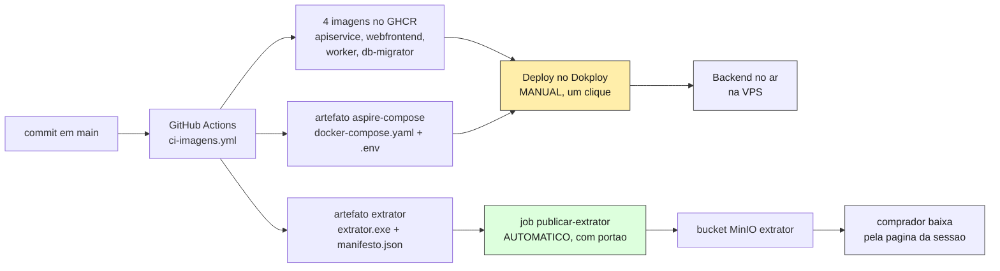

**O executável não viaja em imagem nenhuma.** Ele é WinForms, roda na máquina que enxerga o
PBS, e chega ao comprador por download da página da sessão — servido do MinIO. Por isso são
dois caminhos de entrega, e não um.

| Artefato | Vai para | Quem leva | Quando |
|---|---|---|---|
| 4 imagens de container | GHCR, duas tags cada | CI (`images`) | todo push verde em `main` |
| `docker-compose.yaml` + `.env` | artefato do run | CI (`images`) | idem |
| `extrator.exe` + `manifesto.json` | bucket MinIO `extrator` | CI (`publicar-extrator`) | **só quando a versão muda** |
| — | containers rodando na VPS | **você**, no Dokploy | quando você decidir |

---

## 2. O que é automático e o que não é

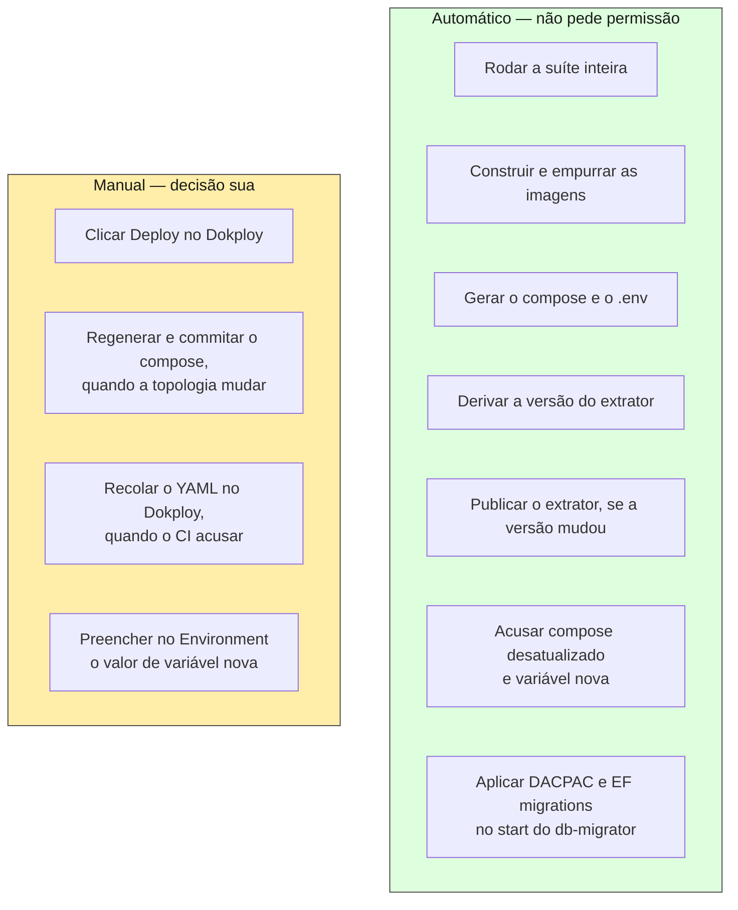

**Por que o deploy do backend continua manual.** O `db-migrator` aplica DACPAC no `Stage`
(com `DropObjectsNotInSource`) e EF migrations no `engine`, contra banco com dado real da
rede. Cada deployment do Dokploy carrega uma descrição escrita à mão dizendo quais migrations
entram e o que muda na leitura dos dados existentes — é o único ponto do fluxo em que alguém
lê a mudança antes de ela alcançar o banco. `autoDeploy` está em `false` de propósito.

**Por que a publicação do extrator é automática.** Não toca banco, não derruba serviço, e o
contrato de import é tolerante nas duas direções (§5). O que ela substituiu era pior: baixar
o `.zip` do Actions, logar como `PowerUser` e subir à mão — passo que ficou esquecido por sete
deploys seguidos.

---

## 3. Etapa 0 — antes de empurrar

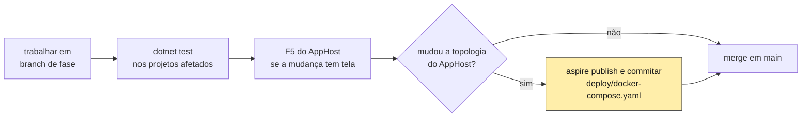

Dois pontos que não são cerimônia:

- **Consulta nova do extrator só vale depois de rodar contra um PBS real.** Nada na suíte
  executa SQL — as queries são recurso embarcado e os testes são unitários. Foi assim que uma
  coluna inexistente passou por 288 testes verdes e morreu na mão do comprador. Use o acesso
  de leitura à instância da Natusfarma.
- **Não há bump de versão do extrator para fazer.** O patch é derivado do histórico (§6). E se
  você esquecer de regenerar o compose, o CI fica vermelho dizendo isso (§4) — nenhum dos dois
  depende de você lembrar.

---

## 4. Etapa 1 — push em `main` dispara o CI

`.github/workflows/ci-imagens.yml`, em push na `main` ou por `workflow_dispatch`. Quatro
jobs, com essa dependência:

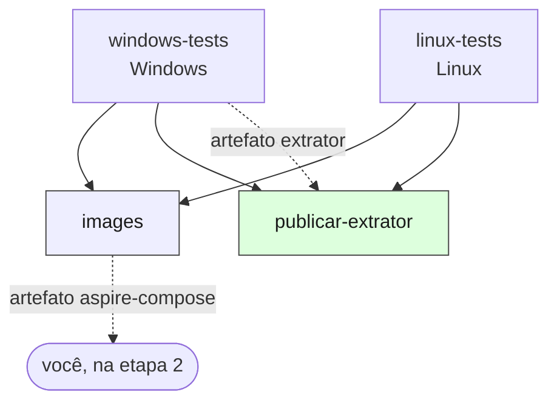

| Job | O que faz | Por que existe assim |
|---|---|---|
| `windows-tests` | Testes do extrator, **deriva a versão** do histórico (§6) e publica o binário: `win-x64` self-contained, SHA-256, `manifesto.json`, tudo no artefato `extrator`. | O extrator é WinForms (`net10.0-windows`) e **não compila em Linux** — nem ele nem o teste dele. A suíte é dividida por sistema operacional por necessidade, não por paralelismo. |
| `linux-tests` | Compila em **Debug**, roda os dez projetos de teste puros e depois os dois que sobem o AppHost real com SQL Server e MinIO em container. | Debug porque é a configuração dos testes, e é dela que sai o DACPAC copiado para o `bin` do `Migrator`. Integração e E2E ficam em passos **sequenciais**: eles se excluem por um lock de arquivo, e em paralelo o segundo esperaria o tempo do lock. |
| `images` | Imagem base do worker, `aspire do push` (as quatro imagens, tag imutável), **smoke** da imagem do worker, tag móvel, `aspire publish` e a **conferência do compose** (abaixo). | Só roda se os dois jobs de teste passarem. |
| `publicar-extrator` | Compara versões e publica o extrator no destino. Só em `main`. | Não depende de `images` — o `.exe` não entra em imagem. Depende de `linux-tests` **por mérito**: extrator não vai para a mão do comprador a partir de commit com o backend vermelho. |

### O smoke do worker, e por que ele não é redundante

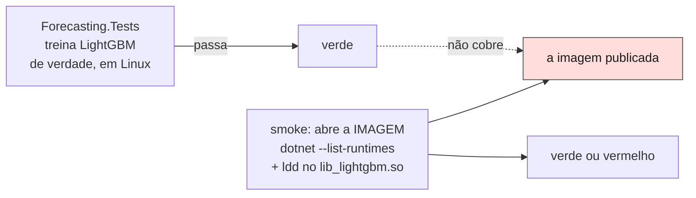

Os testes passam porque o runner do GitHub tem `libgomp1`; a **imagem** não tinha, e o treino
morria em produção com `Unable to load shared library 'lib_lightgbm'`. Entre o teste verde e o
destino existe um artefato que nenhum teste abre. O smoke abre — e confere framework **antes**
do nativo, porque a primeira versão dele passou numa imagem que nem iniciava (exit 150, `No
frameworks were found`, dois dias de fila parada).

O smoke **não barra o push** (o `aspire do push` constrói e empurra na mesma operação). O que
a falha impede é o **uso**: a tag móvel não avança e o artefato de compose não é publicado.

### A conferência do compose, e as duas falhas silenciosas que ela mata

`deploy/docker-compose.yaml` é o **registro** do que o AppHost gera. O job regenera e compara
byte a byte; divergiu, fica vermelho.

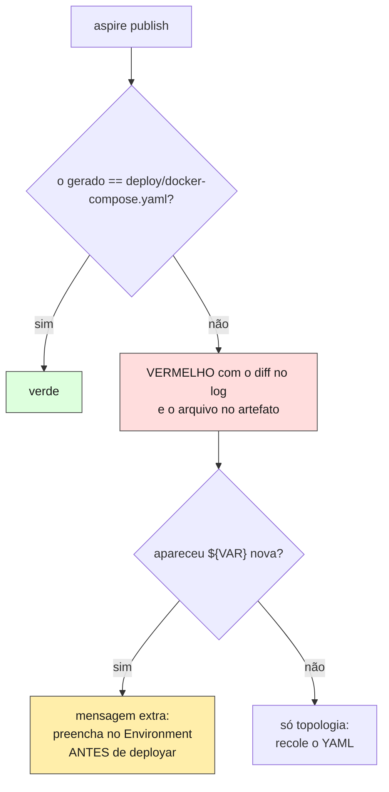

As duas falhas que isso mata já aconteceram. Uma correção de `pull_policy` viveu como edição à
mão no YAML do Dokploy até a regeneração seguinte a apagar em silêncio. E um parâmetro novo do
AppHost virou linha nova no compose que ninguém colou — a variável ficava preenchida no
Environment e o processo não recebia nada, com a falha aparecendo como "não configurado" em vez
de erro.

**Não é preciso rodar nada localmente para consertar.** O passo imprime o diff e o arquivo
regenerado sai no artefato `aspire-compose` da execução, pronto para commitar e para colar no
Dokploy.

**Se um bump do Aspire mudar o formato do YAML, isto fica vermelho — e é o comportamento
desejado.** A ferramenta mudou o que roda em produção; alguém precisa olhar o diff e commitar.
Não é intermitência, é notícia.

---

## 5. Etapa 2 — deploy do backend (manual)

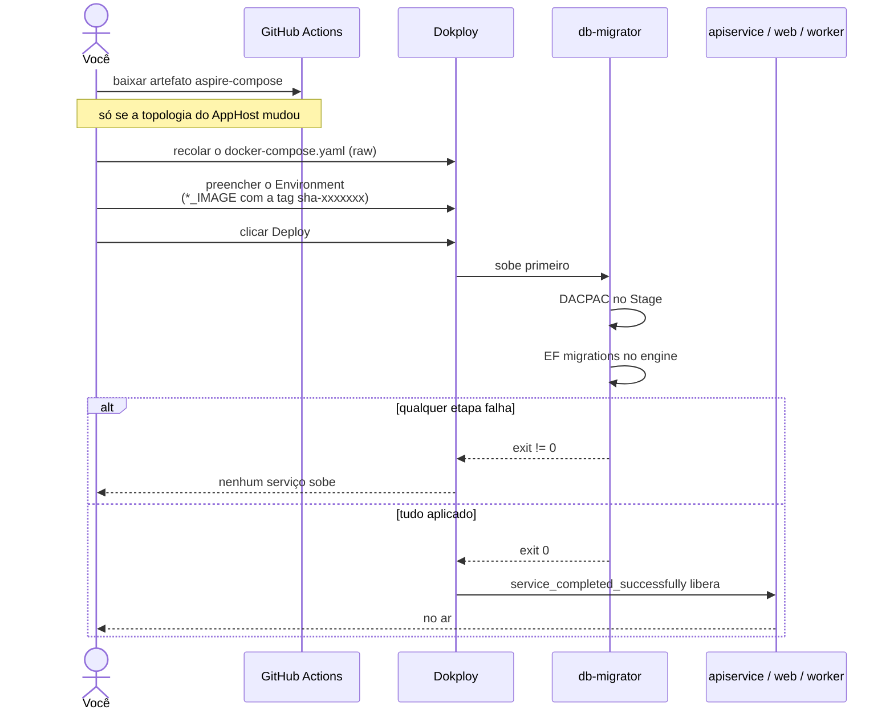

### Quando é preciso recolar o YAML

**Você não decide isso — o CI decide** (§4). O critério continua sendo o de sempre (topologia
mudou: recurso novo, parâmetro novo, env var nova, `depends_on` diferente), mas quem o avalia é
a comparação com `deploy/docker-compose.yaml`: divergiu, o build fica vermelho com o diff; não
divergiu, o YAML do Dokploy continua válido e basta apontar as `*_IMAGE` para as tags novas.

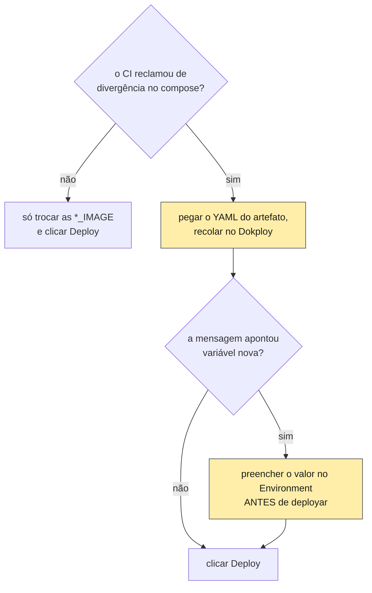

**A ordem entre recolar e preencher importa.** Parâmetro novo no AppHost é linha nova no
compose, e as duas pontas são necessárias: só o valor no Environment sem a linha no YAML deixa
o processo sem receber nada, e a falha aparece como "não configurado" em vez de erro. É a
armadilha que o passo do §4 passou a acusar antes de o deploy acontecer.

### Use a tag imutável

`*_IMAGE` recebe `…/worker:sha-5b36f24` — os 7 primeiros do commit, sem precisar caçar no log
do CI. A tag móvel (`:main`) serve para "o último verde daquela branch"; num `.env` de produção
ela faria o próximo `docker compose pull` puxar outra coisa em silêncio, e "qual commit está
rodando?" deixaria de ter resposta. Os quatro serviços têm `pull_policy: always` justamente
porque o Compose aceita "já existe local" — sem isso, deploy depois de CI verde subiria o
binário antigo **e reportaria sucesso**.

### O que sobe sozinho depois

- **`restart: unless-stopped`** em todos os serviços menos o `db-migrator` (one-shot; com
  política de reinício ele republicaria o DACPAC em loop). Produção já ficou **dois dias sem
  worker** porque o compose não trazia `restart:` e o default do Docker é `no`.
- **`OrfaosWorker`** encerra por idade job preso em `Processando` — as filas reclamam sem
  lease, então linha reclamada por processo morto não é encerrada por ninguém.

---

## 6. Etapa 3 — publicação do extrator (automática)

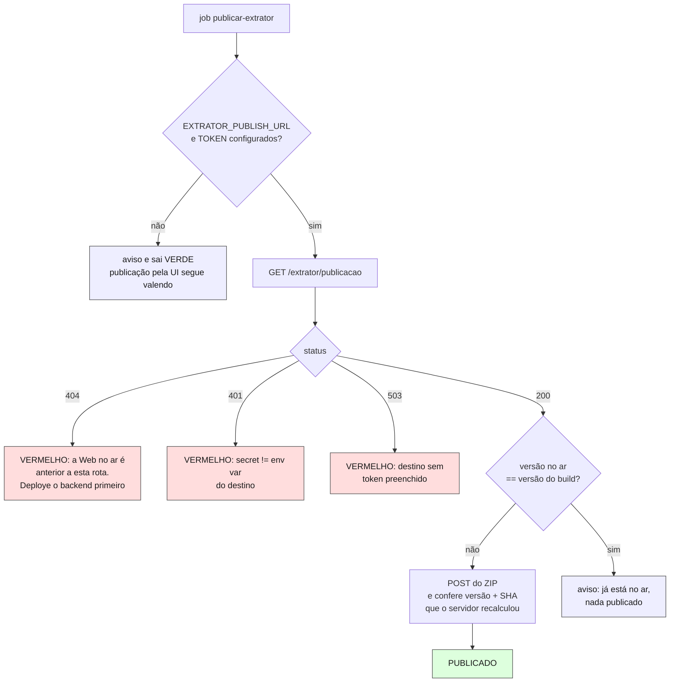

**O portão é a versão, não o commit.** O binário muda em **todo** build mesmo sem mudança no
extrator — o SDK anexa o commit ao `InformationalVersion`, então o SHA-256 sai diferente — com
o `<Version>` parado. Publicar por push encheria a tela do comprador de "0.18.2" com checksum
novo a cada vez, e o checksum é justamente o que ele confere com `Get-FileHash`.

**E o número anda sozinho, porque o patch é derivado do histórico.** O csproj declara a base
(`0.18.2`) e o `windows-tests` soma quantos commits tocaram o projeto do extrator desde o commit
que introduziu essa base:

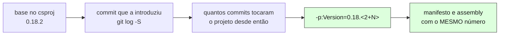

Mexeu no extrator, o número anda e publica. Não mexeu, fica e pula. **Você não bumpa nada** —
minor e major continuam seus, e bumpar a base para `0.19.0` zera a contagem a partir dali (mexa
no minor, nunca no patch: `0.18.2` com 3 commits em cima já é `0.18.5`, e cravar `0.18.5` na
base faria duas árvores diferentes carregarem o mesmo número).

Antes disso existia uma guarda que ficava vermelha quando o `<Version>` estava parado com código
novo. Ela saiu junto com a causa: o estado que ela detectava passou a ser **impossível** em vez
de detectável. Ela tinha nascido de um caso real — `0.18.1` definida em `2d03534`, `cc31b0e`
mexendo no extrator depois sem bump, e as duas correções atravessando sete deploys sem chegar ao
comprador.

**Publicar antes de o backend novo subir é seguro, e por desenho.** O contrato de import é
tolerante nas duas direções: entrada desconhecida no ZIP nunca é validada nem carregada,
arquivo novo entra como `OptionalFiles` e coluna é conferida por nome. Foi assim que o
`catalogo_eans.csv` da 0.18.0 conviveu com o backend anterior. Só uma mudança **destrutiva** de
contrato — renomear ou remover coluna obrigatória — pediria ordenar deploy e publicação.

---

## 7. Decidindo o que fazer, pelo que o commit mudou

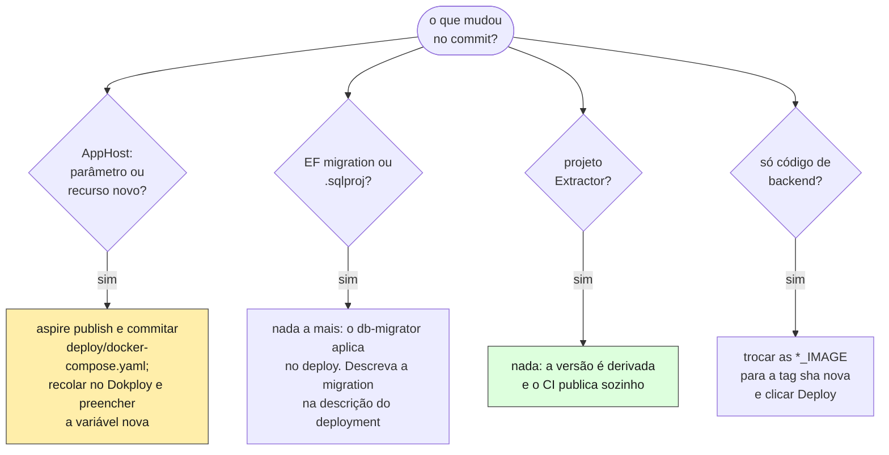

**Mudança no contrato CSV toca os dois lados de uma vez** — `Database`, `Worker`, `ApiService`
e `Extractor/StageContract`. É por isso que os testes do extrator referenciam `Worker` e
`ApiService`: `StageContractTests` e `ImportCompatibilityTests` são o único guarda contra as
duas definições divergirem em silêncio. Nesse caso valem as quatro linhas acima ao mesmo tempo.

---

## 8. Checklist de entrega

```
[ ] Testes verdes localmente nos projetos afetados
[ ] Consulta nova do extrator rodada contra o PBS real
[ ] Se a topologia do AppHost mudou: aspire publish e commitar deploy/docker-compose.yaml
[ ] Push em main; CI verde nos quatro jobs
[ ] Se o CI reclamou do compose: recolar o YAML no Dokploy
[ ] Se a mensagem apontou variável nova: preencher o valor no Environment
[ ] Environment do Dokploy com as *_IMAGE na tag sha-xxxxxxx
[ ] Deploy clicado, com descrição dizendo quais migrations entram
[ ] db-migrator saiu com exit 0 (senão nenhum serviço subiu)
[ ] Login na Web funciona
[ ] Versão do extrator no ar confere em /admin/extrator
```

---

## 9. Quando algo falha, onde olhar

| Sintoma | Causa provável | Onde |
|---|---|---|
| Job `publicar-extrator` em 404 | a Web no ar é anterior à rota `/extrator/publicacao` | deploye o backend primeiro |
| Job `publicar-extrator` em 503 | `EXTRATOR_PUBLISH_TOKEN` vazio no destino, **ou** o YAML colado sem a linha da env var | Environment do Dokploy **e** o compose colado |
| Job `publicar-extrator` em 401 | secret do GitHub != env var do destino | os dois valores |
| Job `images` acusa divergência do compose | a topologia do AppHost mudou e `deploy/docker-compose.yaml` não foi regenerado | commite o arquivo do artefato `aspire-compose` e recole no Dokploy |
| Serviço no ar com variável vazia | o YAML colado no Dokploy é anterior ao parâmetro | o compose colado, não só o Environment |
| Nenhum serviço sobe depois do deploy | `db-migrator` saiu != 0 | log do `db-migrator` no Dokploy |
| Deploy verde mas comportamento antigo | `*_IMAGE` apontando para a tag anterior | Environment do Dokploy |
| Treino morre com `lib_lightgbm` | imagem do worker sem `libgomp1` | smoke do CI; `worker-base.Dockerfile` |
| Fila parada e tela dizendo "importando" | worker morto sem reinício | `restart:` no compose; `docker ps` |
| Tela de mercado toda com travessão | ZIP de extrator anterior à versão que traz `Cnpj`/`catalogo_eans.csv` | versão publicada em `/admin/extrator` |

**Extrator publicado é global, não por rede.** O `.exe` é o mesmo para todo inquilino, então
publicar troca a versão de todos ao mesmo tempo — e um `manifesto.json` incoerente é recusado
sem escrever nada, deixando a versão anterior intacta.

---

## 10. Configuração de uma vez só

Precisa existir antes de o fluxo automático funcionar. Depois disso, nada aqui se repete.

| Onde | Entrada | Valor |
|---|---|---|
| GitHub → Settings → **Variables** | `EXTRATOR_PUBLISH_URL` | URL pública da Web |
| GitHub → Settings → **Secrets** | `EXTRATOR_PUBLISH_TOKEN` | um segredo longo |
| Dokploy → Environment | `EXTRATOR_PUBLISH_TOKEN` | **o mesmo valor** |

A URL fica em *Variables* e não em *Secrets* de propósito: o GitHub mascara valor de secret no
log, e "não consegui falar com `***`" não diz com quem o job tentou falar — justamente na hora
em que o log é necessário. Ela não é segredo; o token é.

Sem essas entradas o fluxo **não falha**: o job avisa e sai verde, e a publicação pela UI em
`/admin/extrator` continua sendo o caminho.

---

## Leituras relacionadas

- [README §5 — Como rodar, publicar o extrator, CI e deploy](../README.md) — a justificativa
  de cada peça, e os buracos que cada uma fechou.
- [CLAUDE.md §5 — Operações de risco](../CLAUDE.md) — o que exige confirmação.
- [extracao-pbs-stage.md](extracao-pbs-stage.md) — o que o extrator lê do PBS.
- [schema.md](schema.md) — as tabelas dos dois bancos.
