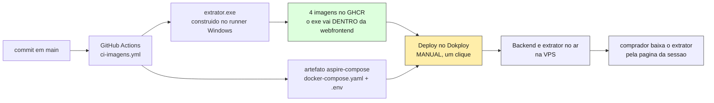
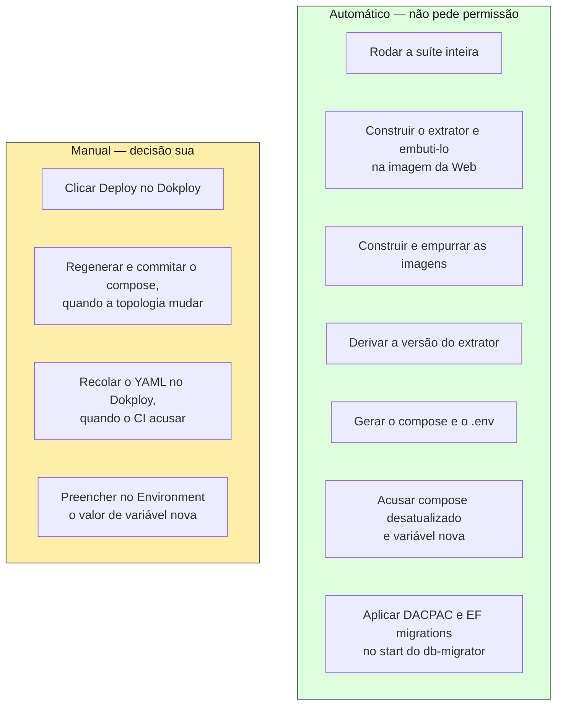
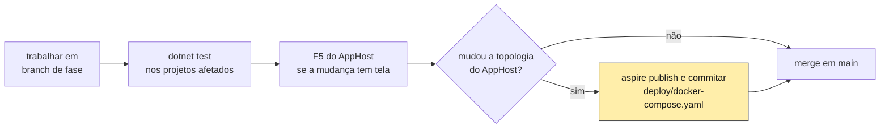
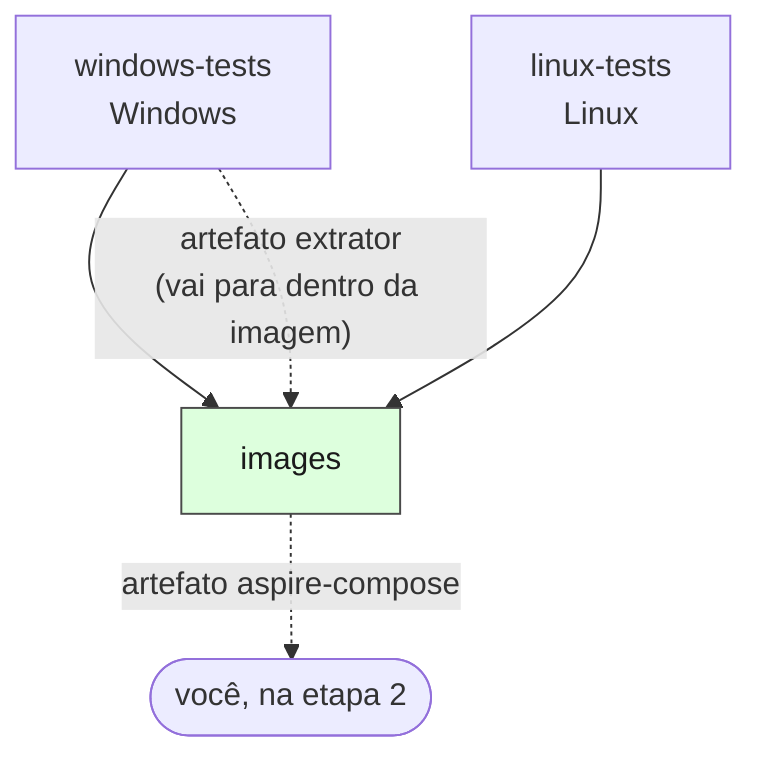
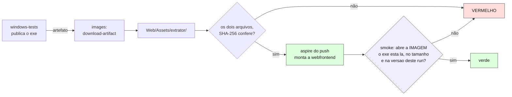
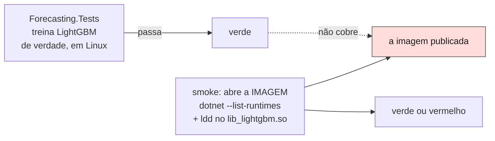
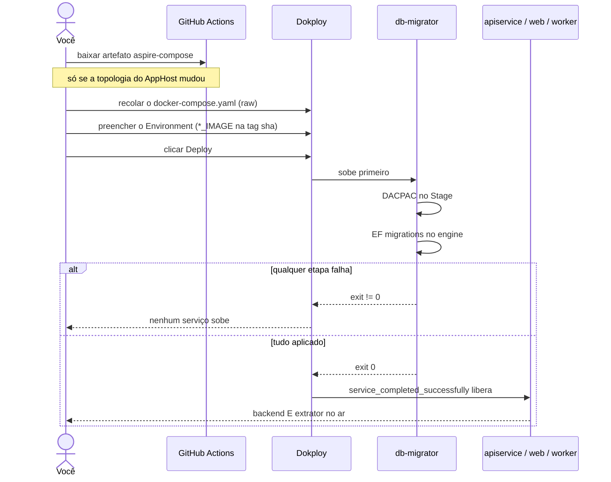
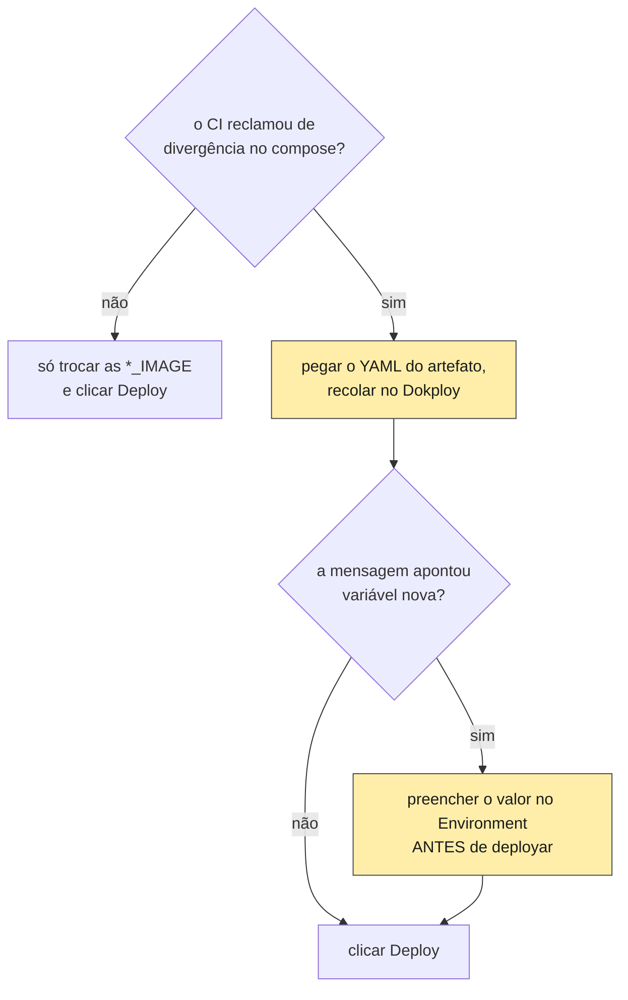
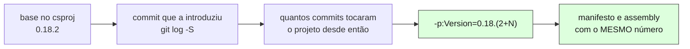
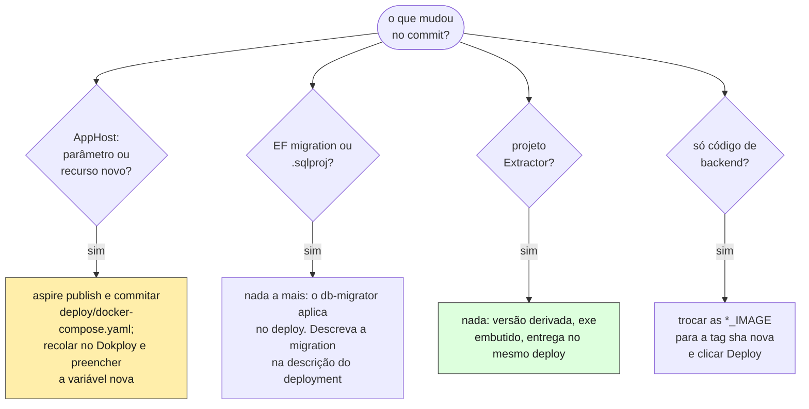

# Fluxo de entrega — do commit ao comprador

> **Para quem é isto:** quem vai entregar uma alteração em produção. Descreve o caminho
> completo — o que é automático, o que exige uma decisão humana, e por que a divisão é essa.
> Complementa o [README do projeto](../README.md) §5, que tem a justificativa de cada peça;
> aqui está a **ordem de execução**.
>
> Ao contrário das docs numeradas desta pasta, este arquivo não é material didático de ML.

---

## 1. Visão de 30 segundos

Um commit em `main` produz artefatos que seguem por **um** caminho até a produção. O
extrator não é exceção: ele vai **dentro** da imagem da Web.



| Artefato | Vai para | Quem leva | Quando |
|---|---|---|---|
| 4 imagens de container, com o extrator embutido na Web | GHCR, duas tags cada | CI (`images`) | todo push verde em `main` |
| `docker-compose.yaml` + `.env` | artefato do run | CI (`images`) | idem |
| — | containers rodando na VPS | **você**, no Dokploy | quando você decidir |

**Aqui existia um segundo caminho de entrega.** O extrator era publicado à parte, num bucket
do MinIO, por um endpoint autenticado por token — e por isso podia estar à frente ou atrás
do backend que o atende. Ele saiu: o executável passou a ser um asset da imagem, e a
pergunta "está à frente ou atrás?" deixou de existir junto com a máquina que a administrava
(§6).

---

## 2. O que é automático e o que não é



**Por que o deploy do backend continua manual.** O `db-migrator` aplica DACPAC no `Stage`
(com `DropObjectsNotInSource`) e EF migrations no `engine`, contra banco com dado real da
rede. Cada deployment do Dokploy carrega uma descrição escrita à mão dizendo quais migrations
entram e o que muda na leitura dos dados existentes — é o único ponto do fluxo em que alguém
lê a mudança antes de ela alcançar o banco. `autoDeploy` está em `false` de propósito.

**E é por isso que o extrator entrar na imagem resolveu, em vez de mais automação.** Um
segundo canal de entrega precisava de token, portão de versão e guarda de bump só para não
se desencontrar do primeiro. Um canal só não precisa de nada disso.

---

## 3. Etapa 0 — antes de empurrar



Dois pontos que não são cerimônia:

- **Consulta nova do extrator só vale depois de rodar contra um PBS real.** Nada na suíte
  executa SQL — as queries são recurso embarcado e os testes são unitários. Foi assim que uma
  coluna inexistente passou por 288 testes verdes e morreu na mão do comprador. Use o acesso
  de leitura à instância da Natusfarma.
- **Não há bump de versão do extrator para fazer.** O patch é derivado do histórico (§6). E
  se você esquecer de regenerar o compose, o CI fica vermelho dizendo isso (§4) — nenhum dos
  dois depende de você lembrar.

No F5 **não há extrator**: quem preenche `Assets/extrator/` é o CI, então o botão de download
fica desabilitado e as telas explicam. Se precisar exercitar esse caminho localmente, o
README tem o passo a passo de gerar o par à mão.

---

## 4. Etapa 1 — push em `main` dispara o CI

`.github/workflows/ci-imagens.yml`, em push na `main` ou por `workflow_dispatch`. Três jobs:



| Job | O que faz | Por que existe assim |
|---|---|---|
| `windows-tests` | Testes do extrator, **deriva a versão** do histórico (§6) e publica o binário: `win-x64` self-contained, SHA-256, `manifesto.json`, tudo no artefato `extrator`. | O extrator é WinForms (`net10.0-windows`) e **não compila em Linux** — nem ele nem o teste dele. A suíte é dividida por sistema operacional por necessidade, não por paralelismo. É o único job com `fetch-depth: 0`, e é a derivação da versão que exige. |
| `linux-tests` | Compila em **Debug**, roda os dez projetos de teste puros e depois os dois que sobem o AppHost real com SQL Server e MinIO em container. | Debug porque é a configuração dos testes, e é dela que sai o DACPAC copiado para o `bin` do `Migrator`. Integração e E2E ficam em passos **sequenciais**: eles se excluem por um lock de arquivo, e em paralelo o segundo esperaria o tempo do lock. |
| `images` | Baixa o artefato `extrator` para `Assets/extrator/`, confere o par, imagem base do worker, `aspire do push`, **dois smokes** (worker e Web), tag móvel, `aspire publish` e a **conferência do compose**. | Só roda se os dois jobs de teste passarem. A dependência do `windows-tests` deixou de ser só ordem: o `.exe` daquele job entra **dentro** da imagem que este monta. |

### O extrator entrando na imagem



**A conferência do par olha o disco; o smoke olha a imagem.** São coisas diferentes, e a
diferença já custou um run: o `<Content Include>` do csproj duplicava o item default do SDK
e o build morria com `NETSDK1022` — erro que **nenhum build local pega**, porque sem a pasta
o glob não casa nada. Aquele foi barulhento; o vizinho silencioso dele é o SDK simplesmente
não copiar o asset e a aplicação subir dizendo ao comprador que esta instalação não traz o
extrator. É a mesma razão do smoke do worker: entre o build verde e o destino existe um
artefato que nenhum teste abre.

O passo **recalcula** o SHA-256 e confere contra o declarado no manifesto. Os dois arquivos
saem do mesmo passo no Windows, então divergir aqui significa artefato corrompido no
transporte — e esse hash é a promessa que a tela mostra ao comprador para ele conferir com
`Get-FileHash`. Publicar um valor que o download não cumpre faria quem conferisse concluir
"executável adulterado".

### O smoke do worker, e por que ele não é redundante



Os testes passam porque o runner do GitHub tem `libgomp1`; a **imagem** não tinha, e o treino
morria em produção com `Unable to load shared library 'lib_lightgbm'`. Entre o teste verde e o
destino existe um artefato que nenhum teste abre. O smoke abre — e confere framework **antes**
do nativo, porque a primeira versão dele passou numa imagem que nem iniciava (exit 150, `No
frameworks were found`, dois dias de fila parada).

O smoke **não barra o push** (o `aspire do push` constrói e empurra na mesma operação). O que
a falha impede é o **uso**: a tag móvel não avança e o artefato de compose não é publicado.

### A conferência do compose, e as duas falhas silenciosas que ela mata

`deploy/docker-compose.yaml` é o **registro** do que o AppHost gera. O job regenera e compara
byte a byte; divergiu, fica vermelho.


As duas falhas que isso mata já aconteceram. Uma correção de `pull_policy` viveu como edição à
mão no YAML do Dokploy até a regeneração seguinte a apagar em silêncio. E um parâmetro novo do
AppHost virou linha nova no compose que ninguém colou — a variável ficava preenchida no
Environment e o processo não recebia nada, com a falha aparecendo como "não configurado" em vez
de erro.

**Não é preciso rodar nada localmente para consertar.** O passo imprime o diff e o arquivo
regenerado sai no artefato `aspire-compose` da execução, pronto para commitar e para colar no
Dokploy.

**Se um bump do Aspire mudar o formato do YAML, isto fica vermelho — e é o comportamento
desejado.** A ferramenta mudou o que roda em produção; alguém precisa olhar o diff e commitar.
Não é intermitência, é notícia.

---

## 5. Etapa 2 — deploy (manual)



**Este clique entrega o extrator também.** É a mudança de desenho: não há segundo passo, nem
segundo artefato para conferir depois.

### Quando é preciso recolar o YAML

**Você não decide isso — o CI decide** (§4). O critério continua sendo o de sempre (topologia
mudou: recurso novo, parâmetro novo, env var nova, `depends_on` diferente), mas quem o avalia é
a comparação com `deploy/docker-compose.yaml`: divergiu, o build fica vermelho com o diff; não
divergiu, o YAML do Dokploy continua válido e basta apontar as `*_IMAGE` para as tags novas.



**A ordem entre recolar e preencher importa.** Parâmetro novo no AppHost é linha nova no
compose, e as duas pontas são necessárias: só o valor no Environment sem a linha no YAML deixa
o processo sem receber nada, e a falha aparece como "não configurado" em vez de erro. É a
armadilha que o passo do §4 passou a acusar antes de o deploy acontecer.

### Use a tag imutável

`*_IMAGE` recebe `…/worker:sha-5b36f24` — os 7 primeiros do commit, sem precisar caçar no log
do CI. A tag móvel (`:main`) serve para "o último verde daquela branch"; num `.env` de produção
ela faria o próximo `docker compose pull` puxar outra coisa em silêncio, e "qual commit está
rodando?" deixaria de ter resposta. Os quatro serviços têm `pull_policy: always` justamente
porque o Compose aceita "já existe local" — sem isso, deploy depois de CI verde subiria o
binário antigo **e reportaria sucesso**.

**A imagem da Web ficou ~118 MB maior**, e isso é pago **uma vez por versão do extrator**, não
por deploy: o executável é byte a byte idêntico enquanto o fonte e a versão não mudam (§6),
então a layer fica cacheada.

### O que sobe sozinho depois

- **`restart: unless-stopped`** em todos os serviços menos o `db-migrator` (one-shot; com
  política de reinício ele republicaria o DACPAC em loop). Produção já ficou **dois dias sem
  worker** porque o compose não trazia `restart:` e o default do Docker é `no`.
- **`OrfaosWorker`** encerra por idade job preso em `Processando` — as filas reclamam sem
  lease, então linha reclamada por processo morto não é encerrada por ninguém.

---

## 6. O extrator: um asset, não uma publicação

O executável vem **dentro** da imagem da Web, em `Assets/extrator/`, **fora de `wwwroot`** — o
`MapStaticAssets` serviria os ~118 MB sem autenticação a quem descobrisse a URL, e o download é
de comprador logado.

**O que isso substituiu, e por que.** Havia um bucket `extrator` no MinIO alimentado por um
endpoint autenticado por token, com portão de versão, guarda de bump, parâmetro Aspire,
variável e secret no GitHub e o valor espelhado no Dokploy. Tudo aquilo administrava **uma**
possibilidade: o extrator estar à frente ou atrás do backend. Sendo o mesmo artefato, ela não
existe.

### A versão anda sozinha, mas os bytes não



Mexeu no extrator, o número anda. Não mexeu, fica. **Você não bumpa nada** — minor e major
continuam seus, e bumpar a base para `0.19.0` reancora a contagem (mexa no minor, nunca no
patch: `0.18.2` com 3 commits em cima já é `0.18.5`).

O porquê é um caso real: `0.18.1` foi definida em `2d03534` e `cc31b0e` mexeu no extrator
depois, sem bump — as duas correções atravessaram **sete deploys** sem chegar ao comprador.

**E o binário só muda quando o extrator muda**, o que não era verdade de graça: o commit
entrava nos bytes por duas vias independentes.

| Via | Como fecha |
|---|---|
| O SDK anexava o commit ao `InformationalVersion` (`0.18.2+a42ed66…`) | `IncludeSourceRevisionInInformationalVersion=false` |
| O SourceLink grava o commit no PDB, e o PE carrega o **checksum do PDB** | `EnableSourceLink=false` |

A segunda não se adivinha, e desligar só a primeira não resolve. O SourceLink lê o **HEAD do
git direto**, não a propriedade `SourceRevisionId` — sobrescrever aquela propriedade não muda
nada. Sem as duas, o comprador veria a mesma versão com um SHA-256 diferente a cada deploy, e a
imagem ganharia uma layer nova de 118 MB em **todo** deploy.

Com as duas, o checksum é identidade de conteúdo: mesma versão ⇒ mesmo arquivo.

### Sem extrator é estado normal, não defeito

No F5 e em qualquer build local a pasta não existe — quem a preenche é o CI. `ExtratorEmbutido`
trata como ausência: botão desabilitado, telas explicando. Manifesto ilegível ou incompleto cai
no mesmo caminho de propósito — tira o download do ar, mas **não** derruba a aplicação.

`/admin/extrator` (só `PowerUser`) mostra versão, checksum e data desta instalação. É tela
informativa; o formulário de upload que existia ali saiu junto com a publicação.

---

## 7. Decidindo o que fazer, pelo que o commit mudou



**Mudança no contrato CSV toca os dois lados de uma vez** — `Database`, `Worker`, `ApiService`
e `Extractor/StageContract`. É por isso que os testes do extrator referenciam `Worker` e
`ApiService`: `StageContractTests` e `ImportCompatibilityTests` são o único guarda contra as
duas definições divergirem em silêncio. E como agora produtor e consumidor do CSV viajam na
mesma imagem, nem uma mudança **destrutiva** de contrato pede coordenação de ordem: os dois
lados trocam juntos.

---

## 8. Checklist de entrega

```
[ ] Testes verdes localmente nos projetos afetados
[ ] Consulta nova do extrator rodada contra o PBS real
[ ] Se a topologia do AppHost mudou: aspire publish e commitar deploy/docker-compose.yaml
[ ] Push em main; CI verde nos três jobs
[ ] Se o CI reclamou do compose: recolar o YAML no Dokploy
[ ] Se a mensagem apontou variável nova: preencher o valor no Environment
[ ] Environment do Dokploy com as *_IMAGE na tag sha-xxxxxxx
[ ] Deploy clicado, com descrição dizendo quais migrations entram
[ ] db-migrator saiu com exit 0 (senão nenhum serviço subiu)
[ ] Login na Web funciona
[ ] /admin/extrator mostra a versão que você esperava
```

---

## 9. Quando algo falha, onde olhar

| Sintoma | Causa provável | Onde |
|---|---|---|
| Job `images` acusa divergência do compose | a topologia do AppHost mudou e `deploy/docker-compose.yaml` não foi regenerado | commite o arquivo do artefato `aspire-compose` e recole no Dokploy |
| Job `images` acusa SHA-256 divergente do extrator | artefato corrompido no transporte entre os jobs | reexecute o run |
| Smoke da Web acusa extrator ausente na imagem | o `Content` do csproj da Web deixou de levar o asset para o publish | `CosmosPro.ML.DemandForCast.Web.csproj`, item `Assets\extrator\**` |
| Serviço no ar com variável vazia | o YAML colado no Dokploy é anterior ao parâmetro | o compose colado, não só o Environment |
| Nenhum serviço sobe depois do deploy | `db-migrator` saiu != 0 | log do `db-migrator` no Dokploy |
| Deploy verde mas comportamento antigo | `*_IMAGE` apontando para a tag anterior | Environment do Dokploy |
| "Esta instalação não traz o extrator" | imagem construída sem o asset, ou manifesto ilegível | log de startup da Web (`ExtratorEmbutido` avisa) e o passo do §4 |
| Versão do extrator diferente da esperada | a imagem no ar é de outro commit | tag em `WEBFRONTEND_IMAGE` |
| Treino morre com `lib_lightgbm` | imagem do worker sem `libgomp1` | smoke do CI; `worker-base.Dockerfile` |
| Fila parada e tela dizendo "importando" | worker morto sem reinício | `restart:` no compose; `docker ps` |
| Tela de mercado toda com travessão | ZIP de extrator anterior à versão que traz `Cnpj`/`catalogo_eans.csv` | versão em `/admin/extrator` |

**O extrator é global, não por rede.** O executável é o mesmo para todo inquilino, então o
deploy troca a versão de todos ao mesmo tempo.

---

## Leituras relacionadas

- [README §5 — Como rodar, o extrator embutido, CI e deploy](../README.md) — a justificativa
  de cada peça, e os buracos que cada uma fechou.
- [CLAUDE.md §5 — Operações de risco](../CLAUDE.md) — o que exige confirmação.
- [extracao-pbs-stage.md](extracao-pbs-stage.md) — o que o extrator lê do PBS.
- [schema.md](schema.md) — as tabelas dos dois bancos.
