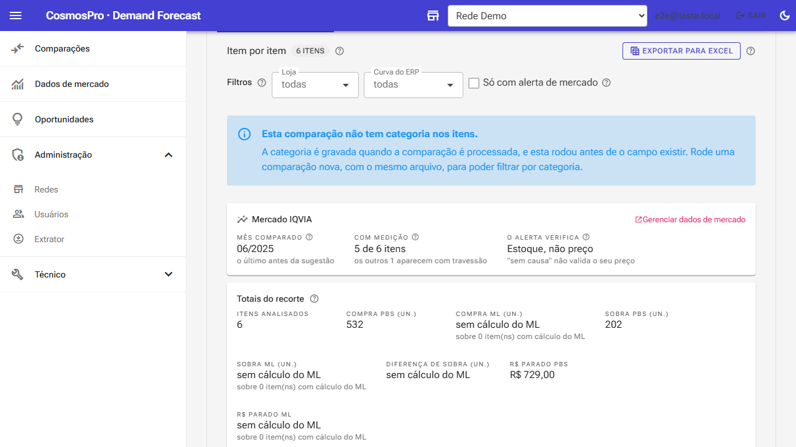
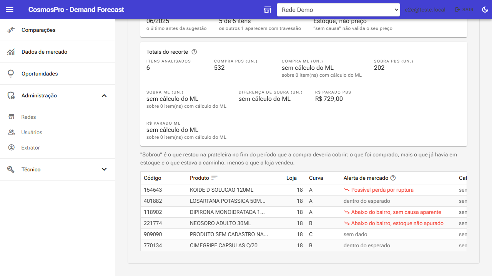
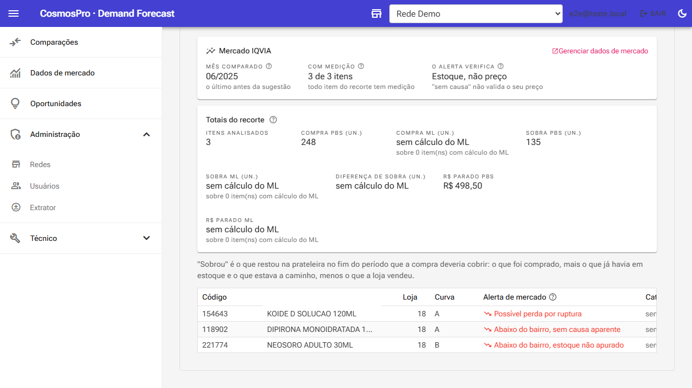
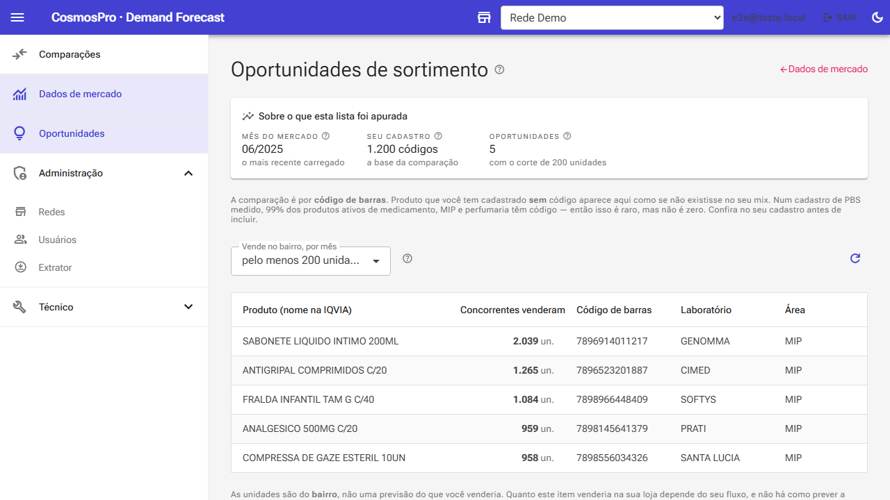
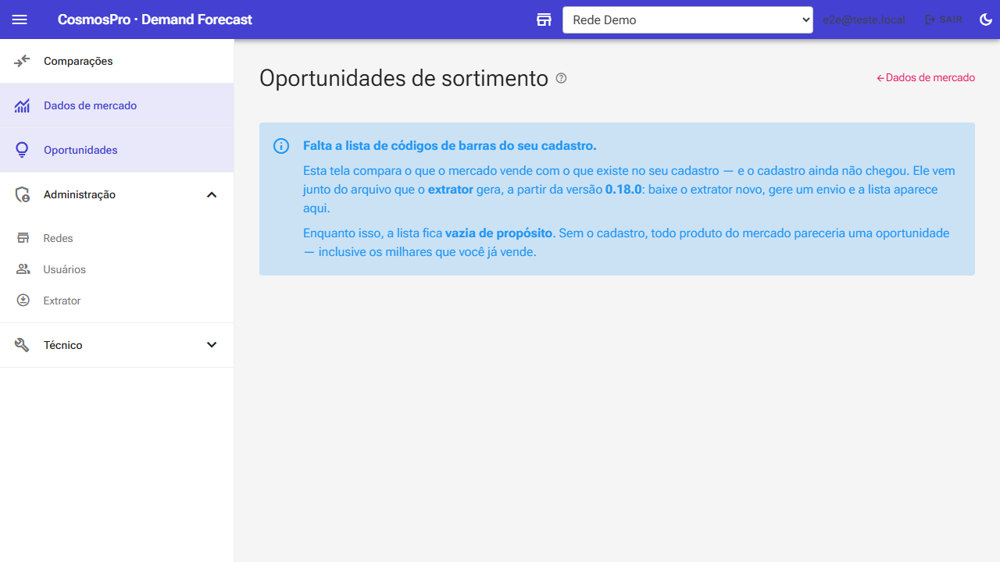
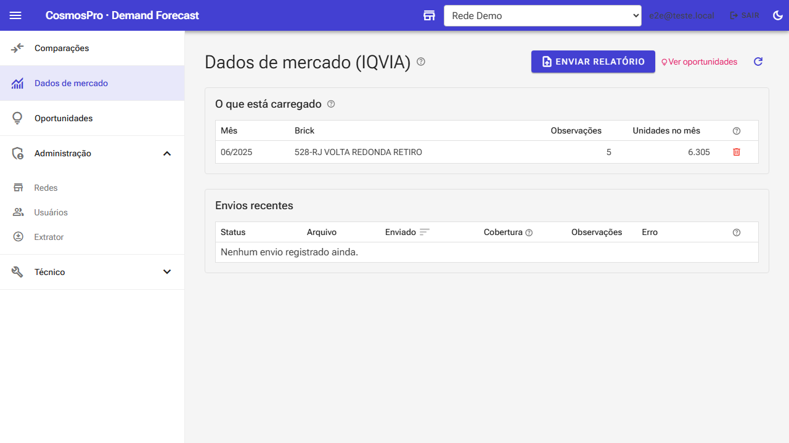

# Roteiro de Avaliação — regras IQVIA na interface

As nove regras da aba **REGRA DE NEGÓCIO IQVIA** do documento de controle, uma por uma: onde
cada uma ficou na tela, o que fazer para vê-la funcionando, e o que decidir. Duas delas não
foram construídas, e a razão está aqui com o número que a sustenta.

| | |
|---|---|
| Em produção desde | 01/09/2026 |
| Versão do extrator | 0.18.1 |
| Itens do acompanhamento | 9, 10 e 11 |
| Telas | capturadas do ambiente real, não são mockups |

---

## 1. Antes de começar: o estado em que você vai encontrar as telas

As duas telas novas dependem de **dois arquivos** que vêm de fora do sistema.

| O que precisa chegar | De onde vem | Sem ele |
|---|---|---|
| **Relatório mensal da IQVIA** (`.xlsx`) | Enviado por você na tela *Dados de mercado* | Nenhuma coluna de mercado aparece |
| **ZIP do extrator 0.18.1** | O comprador gera no PBS e envia numa comparação | As telas explicam a ausência em vez de mostrar número |

**Por que o ZIP tem que ser do 0.18.1.** Os ZIPs anteriores não trazem duas coisas que as
regras precisam: o **CNPJ das lojas**, que é o que liga cada loja ao bairro da IQVIA, e a
**lista de códigos de barras do cadastro**, que é a base da comparação de sortimento.

O **0.18.0 não serve** — ele quebra na primeira etapa. Foi um defeito nosso, corrigido no
0.18.1. O número é como vocês distinguem os dois builds.

---

## 2. Item 10 do acompanhamento — grupo B: comparar o que está nas duas bases

**Onde encontrar:** abra uma comparação concluída em **Comparações** e desça até a aba
**Itens comparados**. Tudo do grupo B mora ali, ao lado da decisão do PBS — de propósito: é
onde o comprador já decide.

O painel que abre a seção declara **sobre o que** os alertas foram apurados — e diz o que
*não* foi verificado.

### IQVIA-B1 — Comparar o desempenho da rede contra o mercado do bairro

**Onde ficou:** coluna **Índice vs bairro**. Passe o mouse no número e o balão mostra as
unidades que o produziram: quanto a rede vendeu e quanto os concorrentes venderam naquele
bairro e mês.

**O que o número significa.** *Não é fatia de mercado.* É a fatia que a rede tem **naquele
item** dividida pela fatia que ela tem **no bairro somando tudo**. Então 1,00 quer dizer
"este item vai tão bem quanto a rede vai neste bairro", e 0,50 quer dizer "vai pela metade".

A régua natural — comparar com o número de lojas concorrentes — **não é calculável**: aquele
contador existe na planilha só numa área de tabela dinâmica, e não numa coluna de dado. Ver a
decisão 3.

**Avalie:**

- [ ] O índice diz algo que você usaria, ou você precisaria da fatia de mercado bruta?
- [ ] O balão com as unidades é suficiente para auditar o número, ou elas deveriam ser colunas?

### IQVIA-B2 — Acender alerta quando a participação está mais de 50% abaixo

**Onde ficou:** coluna **Alerta de mercado**, e o filtro **"Só com alerta de mercado"** acima
da tabela. O corte é o seu: índice abaixo de **0,50**.

**Como ver funcionando:**

1. Marque *Só com alerta de mercado*.
2. Confira que o contador ao lado do título encolhe ("3 de 6 itens").
3. Confira que os **totalizadores** encolhem junto — eles falam do recorte, não da sugestão
   inteira.

**Um número que vale para a dissertação.** Medido no arquivo de junho/2026: a Retiro vende
**57% acima** do que o número de lojas dela nos bairros explicaria. Como ela está acima da
média, o corte de 50% pega a cauda ruim e não metade da tabela — **dispara em 15% dos itens**.
É o comportamento desejado, mas convém saber disso antes de o comprador ver a tela.

**Avalie:**

- [ ] 15% de itens com alerta é volume que o comprador trabalha, ou é muito?
- [ ] O corte deve ser fixo em 50%, ou virar controle na tela como o da outra aba?

Os cinco estados que a coluna produz. **Repare que "sem dado" e "dentro do esperado" são
diferentes** — ausência de medição não é aprovação.

### IQVIA-B3 — Investigar perda de venda por ruptura

**Onde ficou:** coluna **Dias sem estoque**, e o rótulo *"Possível perda por ruptura"* na
coluna de alerta quando houve dia zerado.

**Atenção à janela — é fácil ler errado.** São dias sem estoque **dentro do mês da IQVIA que
está sendo comparado** (o mês no painel), e **não** no período que a compra deveria cobrir.
São perguntas diferentes: aqui é "por que vendemos pouco naquele mês", e a ruptura da
cobertura da compra aparece na manchete, mais acima na mesma tela.

**Avalie:**

- [ ] A distinção entre as duas janelas de ruptura está clara, ou vai confundir?
- [ ] Travessão em "Dias sem estoque" significa "não deu para apurar", nunca zero. Isso lê bem?

### IQVIA-B6 — Baixa participação sem causa identificada

**Onde ficou:** rótulo *"Abaixo do bairro, sem causa aparente"*. E há um quinto estado que a
planilha não previa: *"Abaixo do bairro, estoque não apurado"*.

**Por que criamos o quinto estado.** Quando o mês comparado não veio no histórico de estoque
do arquivo, não se sabe se faltou produto. Dizer "sem causa aparente" ali seria **afirmar que
não houve ruptura sem ninguém ter olhado**. Os dois casos pedem ação diferente: um vai para
sua análise, o outro pede um arquivo com mais histórico.

**Avalie:**

- [ ] O quinto estado ajuda, ou é distinção fina demais para a tela do comprador?
- [ ] Passe o mouse no alerta: a frase por linha diz o que foi e o que *não* foi verificado. É
      o suficiente?

O filtro em ação. Os totalizadores acima recalculam sobre o recorte — a planilha exportada
também.

---

## 3. Item 9 do acompanhamento — grupo A: o que o mercado vende e a rede não tem

**Onde encontrar:** menu lateral, **Oportunidades**. É tela própria, e não parte da
comparação, por um motivo simples: um produto que a rede não tem *não aparece* numa sugestão
de compra — ele não tem linha lá.

As unidades do bairro vêm logo depois do nome, porque são elas que justificam o item estar na
lista.

### IQVIA-A1 — Achar o produto que vende no bairro e não está no cadastro

**Como funciona:** a comparação é por **código de barras** — o que a IQVIA reportou no bairro
contra a lista de códigos do cadastro da rede, que chega no ZIP do extrator.

**O risco que medimos antes de construir.** Produto que a rede *tem* mas cadastrado **sem**
código de barras fica invisível para a comparação — e apareceria aqui como oportunidade,
fazendo o comprador comprar o que já tem. Medimos numa instalação real de PBS antes de
escrever a tela:

| Recorte do cadastro | Cobertura de código de barras |
|---|---|
| Cadastro inteiro (inclui registro inativo) | 36,4% |
| Só o cadastro **ativo** | 90,2% |
| **Só as seções que a IQVIA cobre** (medicamento, MIP, perfumaria, mercearia) | **98,6% a 99,4%** |

Nas seções que importam, o risco é de **1,3%**. Foi esse número que dispensou uma coluna de
"possivelmente você já tem" que estava planejada — com 99% de cobertura, ela mediria ruído.

**Avalie:**

- [ ] A ressalva do código de barras, acima da lista, está no tom certo? Ela é a única defesa
      contra o falso positivo.
- [ ] O painel declara o tamanho do cadastro comparado. Isso dá confiança no denominador?

### IQVIA-A2 — Filtrar por relevância comercial

**Você estava certo, e o número mostra o tamanho.** A planilha dizia "não recomendar
indiscriminadamente todos os itens encontrados". Sem filtro, a regra A1 devolve **44.874
avisos** — e 95% deles são de produtos que vendem menos de uma unidade por loja por mês. Não é
ruído: é uma lista que ninguém abre duas vezes.

| Corte | Avisos | Produtos |
|---|---|---|
| sem filtro | 44.874 | — |
| ≥ 50 unidades no bairro | 1.331 | 899 |
| **≥ 200 unidades (padrão)** | **156** | **116** |
| ≥ 1.000 unidades | 4 | 3 |

**Por que "no bairro" e não "por loja".** O rótulo do controle diz *unidades no bairro*. Sua
régua natural seria por loja concorrente, mas esse contador não está disponível como dado —
ver a decisão 3. O efeito colateral: o corte absoluto favorece o bairro com mais lojas
concorrentes.

**Avalie:**

- [ ] Troque o corte no controle e veja a lista mudar. O padrão de 200 é o ponto certo?
- [ ] O corte deve ficar visível ao comprador, ou ser decidido por vocês e escondido?

### IQVIA-A3 — Apresentar como oportunidade de inclusão no mix

**O que a lista mostra:** nome do produto **no catálogo da IQVIA** (a rede não tem cadastro
dele, então não há nome dela), unidades que os concorrentes venderam, código de barras,
laboratório, área da farmácia e bairro. Ordenada por unidades.

**Um limite que a tela declara, e que vale discutir.** A lista diz **quanto o bairro move**,
não quanto a rede venderia. Não há como prever a venda de um produto que a rede nunca vendeu —
o ML não tem série para isso. Transformar unidades do bairro em quantidade sugerida de compra
seria invenção, e por isso não foi feito.

**Avalie:**

- [ ] Faltam colunas para o comprador decidir? Preço de referência, por exemplo.
- [ ] A ordenação por unidades é a útil, ou deveria ser por valor?
- [ ] Vale existir uma ação na linha ("marcar para avaliar", exportar), ou a lista basta?

**Este é o estado que você provavelmente verá primeiro**, antes de o comprador enviar um ZIP
do extrator novo. A lista fica vazia de propósito: sem o cadastro, todo produto do mercado
pareceria oportunidade.

---

## 4. Fora do corte: duas regras não foram construídas, e não por prioridade

### IQVIA-B4 — Investigar desvio de preço · **impossível com esta fonte**

B4 compara nosso preço com o do concorrente. O arquivo tem coluna de reais, então parece dar.
Dividimos reais por unidades — que é o preço médio — e comparamos:

| Comparação | Pares medidos | Diferenças |
|---|---|---|
| Nosso preço × concorrente, mesmo bairro e mês | 37.410 | **zero** |
| Entre bairros, mesma bandeira e mês | 55.979 | **zero** |
| Entre meses | 62.161 | quase todos diferem |

**O que isso quer dizer.** A IQVIA **não publica o preço que cada loja cobrou**. Ela usa um
preço de referência único por produto e por mês, e multiplica pelas unidades. A coluna de reais
é "unidades × preço de tabela" — ela não carrega preço de ninguém.

Construída como está, B4 devolveria sempre um número, e o número não significaria o que a
regra promete: um item nosso poderia ser apontado como caro só porque a referência é
normalizada, não porque o vizinho cobra menos.

**O que a tela faz no lugar.** Declara, sempre visível, que **o alerta verifica estoque e não
preço**, e que "sem causa aparente" não valida o seu preço. Sem essa frase, quem lê o alerta
concluiria que preço foi conferido e descartado.

### IQVIA-B5 — Calcular o preço médio · **caiu junto com B4**

B5 existia para alimentar B4. Sem B4, o cálculo não tem consumidor. O preço médio da rede
continua disponível no dado importado — o que não existe é o lado contra o qual compará-lo.

---

## 5. Ainda não avaliável: o que só aparece depois do primeiro envio novo

A tela **Dados de mercado**, onde o relatório da IQVIA entra. A cobertura por mês × bairro é o
que as duas telas consultam.

**O mês comparado é sempre anterior ao mês da sugestão — e isso é metodológico.** O mês da
sugestão já contém o efeito da compra que está sendo avaliada. Usá-lo faria o alerta descrever
a própria decisão em vez de antecipá-la, e a afirmação "o alerta da IQVIA teria avisado o
comprador" ficaria circular.

Com um único relatório carregado, a regra cai no **mesmo mês do ano anterior**, que todo
arquivo da IQVIA traz e que é sazonalmente comparável. Conforme vocês empilharem arquivos
mensais, ela passa sozinha para o mês imediatamente anterior. A tela sempre declara qual mês
usou.

**O que fazer para destravar a avaliação completa:**

1. O comprador baixa o **extrator 0.18.1** e gera um envio novo.
2. Confira, na tela de comparação, se as colunas de mercado saíram do travessão.
3. Confira, em Oportunidades, se o painel mostra o tamanho do cadastro.

---

## 6. Cinco decisões que não são de implementação

**1. A regra B4: redefinir ou remover?**
Como está, ela é impossível. Duas saídas: **redefinir** como "nosso preço contra a referência
da IQVIA", dizendo isso com essas palavras na tela; ou **remover**, e o item cai direto em B6.
A primeira entrega algo útil sem afirmar o que o dado não sustenta; a segunda é mais honesta e
mais pobre.

**2. FARMA ONE está do nosso lado ou do lado dos concorrentes?**
**Esta é a única pergunta que pode enviesar todos os alertas.** A aba de PDVs lista 6 lojas
FARMA ONE nos três bairros, mas o arquivo *não tem coluna de venda* para essa bandeira — as
vendas delas estão dentro de "DROGARIA RETIRO" ou dentro de "CONCORRENTES", e não há como
saber qual. Se estiverem em concorrentes, 6 de 29 lojas próprias contam como concorrência, a
fatia da rede sai subestimada e **todo alerta dispara mais do que deveria**. Quem puxa o
relatório sabe responder; se a resposta for "estão em concorrentes", basta pedir FARMA ONE como
bandeira própria na próxima extração — não muda uma linha de código.

**3. Pedir o contador de lojas como coluna no relatório?**
O número de PDVs por bairro existe na planilha, mas só numa área de tabela dinâmica — não é
dado que se leia com segurança. Com ele, duas coisas melhoram: o corte de relevância volta a
ser "por loja" em vez de absoluto, e a régua do B2 pode usar a fatia esperada pelo número de
lojas. Vale pedir ao fornecedor uma coluna de contagem na aba de PDVs?

**4. Uma coluna de "dinheiro deixado na mesa"?**
Hoje a lista de oportunidades ordena por unidades. Para priorizar, o que ajudaria é o valor:
uma lacuna de 500 unidades num item de R$ 80 pesa mais que num de R$ 2. Mas a métrica certa
não é o valor de mercado — é a lacuna em reais, que é conta nova e não está nas nove regras.
Vale existir?

**5. O corte de 50% do B2 fica fixo?**
Ele dispara em 15% dos itens com a régua atual. O corte de relevância da outra aba virou
controle na tela; este continua fixo no código. Deve virar controle também, ou é parâmetro de
pesquisa que não deve variar entre compradores?

---

**Item 11 do acompanhamento** — clima, sazonalidade e dados epidemiológicos — não foi tocado
nesta fase. A tabela existe no banco desde antes, mas nada a alimenta e nada a consome: é o
mesmo estado em que o dado da IQVIA estava antes deste trabalho.
